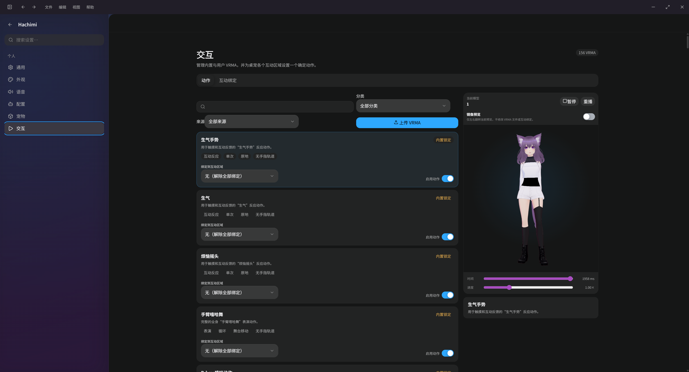
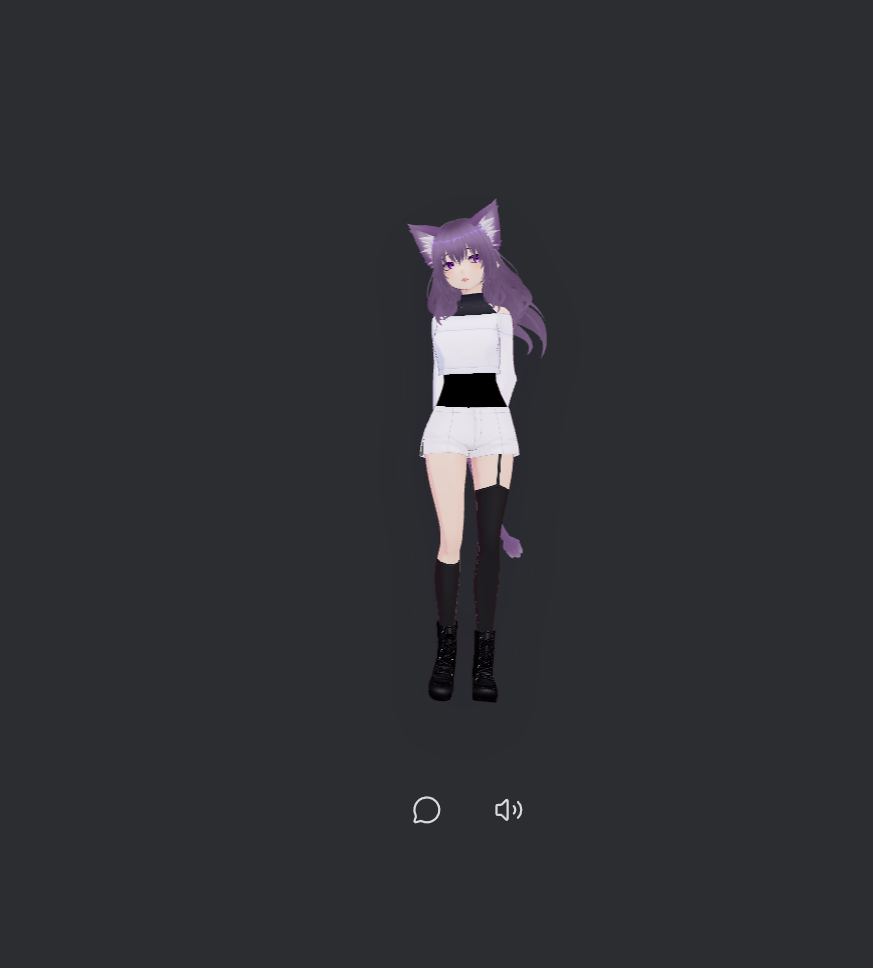

# Hachimi Desktop

Hachimi 是一个 Windows 先行、保持跨平台边界的桌面 Agent 与透明 3D 桌宠。当前开发预览版由 Tauri 2、Rust、SolidJS 和 Three.js/three-vrm 构建，包含统一 Workbench/Pet Agent Runtime、项目与 Session、工具调用、Browser/Computer、本地 Plugins/Connectors、Gateway/Channels、Scheduled Tasks、离线语音识别和离线语音合成。

> 项目目前处于 Beta 阶段，源码版本为 `0.3.0-alpha.8`，但 `v0.3.0-alpha.8` 尚未创建 tag 或发布。`v0.2.1` 已取消，升级验证基线仍为已发布的 `v0.2.0`；`alpha.1`–`alpha.7` 未发布并由 alpha.8 合并取代。源码采用 Apache-2.0，官方预编译包因默认 VRM 的许可限制属于非商业发行。

## 界面预览

Workbench 提供模型、动作、互动区域和语音等运行时配置，并可直接预览当前 VRM 与 VRMA 动作：



桌宠窗口保持透明、置顶，并提供聊天和语音入口：

<p align="center">
  
</p>

## 已实现

- Pet 与 Workbench 是相互协调的独立窗口；Workbench 显示时隐藏 Pet，最小化或关闭后恢复 Pet。
- Workbench 包含主页、完整设置路由、自绘标题栏、窗口控制、动作设置和动作库实验室。
- 仅接受通过 Detector 4 严格检测的 Runtime Ready VRM 0.x/1.0；普通 GLB 不会进入 V4 Catalog，加载失败时回退到内置 SVG 故障角色。
- Avatar Motion Runtime V4 提供 163 个去重内置 VRMA、用户 VRMA 两阶段导入、Humanoid 重定向、手指保留、惯性化、平衡/接触/IK/关节/碰撞约束，以及独立的口型、注视与 SpringBone 通道。
- Pet 与 Workbench 复用同一持久化 Session/Run/Item Agent Runtime，支持历史恢复、Tool、Skills、MCP、Approval/UserInput、Compaction、Review 和后台任务；API Key 保存在系统 Keyring。
- Workbench 已实现 General/Project Session、新 Run、活动 Run Steer、终态 Run Fork、rename/pin/archive/search、Monaco、Terminal、通用 Git push、Forge PR/MR，以及统一会话内的 Browser/Computer Host Inspector。
- Scheduled Tasks 支持 At/Every/Cron/Event、Standalone/Session continuation、Worktree、ScheduleGrant、NeedsAttention、retry、停止条件、通知、事件去重 ledger 和重启 reconciliation。
- Plugin contribution 的 install/enable/disable/update/rollback/uninstall、known-good revision、进程崩溃 reconciliation 和跨产品清理已实现；不建设 Marketplace。
- 企业微信、钉钉、飞书的 REST Connector、Channel/EventSource、结构化 mention、受控附件下载与 Gateway ledger 已实现；企业微信 Gateway 支持官方 GET `echostr` 与 POST 加密 XML callback，钉钉使用 Stream WebSocket，飞书使用 WebSocket/protobuf supervisor [ref:WECOM-API-20260730] [ref:DINGTALK-STREAM-SDK-GO-20260731] [ref:FEISHU-SDK-GO-20260731]。三个真实外部企业组织仍待验证，不能把 fixture 宣传为真实连通。
- Office 能力以本地 DOCX/XLSX/PPTX/PDF 和文件整理工作流为产品边界，通过 Skills、普通 Tool/MCP、Artifact 与真实格式校验实现，不依赖在线 Office 服务。
- SenseVoice-Small INT8 在本地识别中文、英文、日语、韩语和粤语。
- sherpa-onnx VITS/MeloTTS 在 Rust 进程内完成中英双语合成；支持导入 `.tar.bz2` VITS 模型、选择 Speaker ID、50%–200% 语速及静音。
- Windows 下 STT 与 TTS 可分别选择 Auto、DirectML 或 CPU。DirectML 会按独立显存枚举并尝试真实 DXGI Adapter，失败后重建 CPU Session。

当前实现分支已接入 capability-driven Provider registry，以及公开 OpenAI `/v1/chat/completions`、`/v1/responses`、`/v1/embeddings` 三类协议；Responses-only Remote Compaction 会在失败或 capability drift 时回退本地 checkpoint，reasoning summary 只接受 Provider 明确标记为可展示的有界输出 [ref:OAI-PRODUCT-RESPONSES-20260730]。真实 OpenAI staging Gate 尚无凭据，版本发布仍为环境阻塞。

Run crash recovery、Multi-Agent、通用 Git push、GitHub/GitLab/Gitee/Gitea/Forgejo PR/MR、完整 Plugin 生命周期，以及统一 Workbench 的 Browser/Computer 原语已完成本地实现。多数 Forge API 不支持原地更换 PR/MR 源分支，因此源分支在更新时是不可变前置条件；更换源分支必须新建 PR/MR [ref:GITHUB-API-20260730] [ref:GITLAB-API-20260730] [ref:GITEE-API-20260730] [ref:GITEA-FORGEJO-API-20260730]。

当前控制协议已统一为 v31，migration 已到 `0031_plugin_builtin_channel_binding.sql`，包含共享迁移锁/Online Backup、Multi-Agent 启动 reconciliation、统一企业账户编排、官方内置 Channel 绑定、持久 CEF Workspace/Tab/Lease 和统一 Browser/Computer Host policy。运行时能力提供本地停用开关；关闭时 UI 隐藏入口、相关工具不注册，命令稳定返回 `feature_disabled` 和 feature key。

设置中的“平台集成”统一管理企业微信、钉钉和飞书的 API 与消息账户；正式 UI 不展示 `sample-crm`、`mock-poll` 或 `loopback-webhook`。Gateway 根据已启用消息账户自动启动和停止，不再提供用户总开关。Plugins Runtime 继续承载官方 Bundle，但用户管理入口当前统一置灰为“规划中”；第三方 Bundle 产品化与用户管理界面属于后续计划，Marketplace 仍不实现。

桌面 Host 按当前 Windows 用户保持单实例；重复启动只恢复并聚焦已有工作台或桌宠，不会重复初始化 Agent、调度器、托盘和本地状态。启用平台消息后允许独立的 `hachimi-desktop.exe --gateway` 后台进程继续承担登录启动和消息恢复。

Memory 保持远期，不采用 Codex Memory 方案。macOS/Linux 尚未验证；`v0.2.1` 已取消，alpha.8、RC 与 GA 均未发布。每项能力的“实现状态”和“真实环境验证”双状态见 [路线图](docs/ROADMAP.md)。

## 功能状态与后置验证

| 项目                    | 实现状态           | 真实环境验证   | 结论                                                                                                                          |
| ----------------------- | ------------------ | -------------- | ----------------------------------------------------------------------------------------------------------------------------- |
| P1 Run Recovery         | 代码与本地测试完成 | 真实环境待验证 | 六阶段 crash injection、generation/lease fencing 与人工恢复决策已覆盖                                                         |
| P2–P3 Provider          | 代码与本地测试完成 | 真实环境待验证 | 三类公开协议、Remote Compaction 回退与公开 summary 过滤已覆盖；未执行真实 OpenAI staging                                      |
| P4 Multi-Agent          | 代码与本地测试完成 | 真实环境待验证 | execution lease、启动 reconciliation、权限/预算/取消/Usage/Artifact lineage 已覆盖                                            |
| P5 Git/Forge            | 代码与本地测试完成 | 真实环境待验证 | 标准 Git、四类 Forge adapter、未知响应只读 reconciliation 与 supplied Approval 精确 fencing 已覆盖；未执行真实 Forge mutation |
| P6 Plugin lifecycle     | 代码与本地测试完成 | 真实环境待验证 | 十类 contribution lifecycle 和无残留矩阵已覆盖                                                                                |
| P7 企业平台             | 代码与本地测试完成 | 真实环境待验证 | transport、mention、附件下载与企业微信原始 callback 均已实现；未执行三个真实外部组织 Gate                                     |
| P8 Unified Host control | 代码与本地测试完成 | 真实环境待验证 | Workbench 会话、Browser/Computer Inspector、lease 与 stale generation fencing 已覆盖；未执行 standard-user Windows smoke      |
| `v0.3.0-alpha.8` 发布   | 部分完成           | 真实环境待验证 | 版本/许可/Gate/证据与发布 workflow 已实现；未构建候选、未执行外部 Gate、未 tag 或发布                                         |
| `v0.2.1`                | 取消               | 不适用         | 不再发布；跨版本升级基线固定为 `v0.2.0`                                                                                       |

fixture、mock、loopback transport 和确定性 Host 只证明本地实现，不构成真实 OpenAI、Forge、外部企业组织或 standard-user/elevated Windows 发布证据。Hachimi 本身保持本机单用户运行，不提供登录或租户体系；企业配置中的 tenant/corp 仅是外部平台组织标识。

本项目不建设 Marketplace；扩展继续使用本地、内容寻址且权限受控的 Plugin Bundle。Agent Workspace、AppServer 与 Gateway 保持本机单用户运行，不实现 Remote Workspace 或远程多租户 Control Plane。

发布 Gate、受保护 JSON schema、Credential Manager 引用和证据格式见 [0.3.0 发布 Gate](docs/RELEASE_GATES.md)。

Bundle Identifier：`com.hachimi.desktop`

## 可动态配置的运行时能力

- **大语言模型**：可配置 OpenAI-compatible Base URL、模型、协议、兼容档案、API Key 和 Token 上限。API Key 保存在系统 Keyring；公开 Chat Completions、Responses 与 Embeddings 使用统一 capability registry，Agent 历史、Tool loop、恢复和本地 compaction 仍由唯一 Runtime 管理。
- **3D 角色模型**：可在运行时导入和切换通过 Detector 4 检测的 VRM 0.x/1.0 模型，不需要重新构建应用。
- **动作**：可导入 VRMA、启用或禁用动作、按分类筛选、绑定身体互动区域，并设置镜像和冷却；Motion Lab 可用于预览动作及检查骨骼轨道。
- **语音识别**：内置 SenseVoice-Small，可为 STT 单独选择 Auto、DirectML 或 CPU。当前不能导入或切换为其他 STT 模型。
- **语音合成**：可导入和切换 sherpa-onnx VITS 模型、选择多说话人模型的 Speaker ID、调整 50%–200% 语速或静音，并为 TTS 单独选择 Auto、DirectML 或 CPU。

## VRM、语音模型与 VRMA 导入要求

### VRM 3D 角色模型

可以从 [VRoid Hub](https://hub.vroid.com/) 下载作者开放下载的 VRM 角色，也可以使用 VRoid Studio 创建自己的模型。下载前必须查看每个角色的使用条件；“允许下载”不等于允许修改、商用、截图宣传或随 Hachimi 安装包再分发。

Hachimi 的导入限制如下：

- 只接受扩展名为 `.vrm` 的 VRM 0.x 或 VRM 1.0 二进制模型，最大 200 MiB；普通 `.glb` 或仅修改了扩展名的 GLB 不受支持。
- 模型必须自包含，不允许引用外部 Buffer、贴图或其他资源；必须具有可渲染的蒙皮网格、有效边界、有效蒙皮权重和 VRM 标准 Humanoid 骨骼。
- 资源预算上限为 150,000 个三角形、512 个节点、256 个关节、64 个材质、64 张纹理；单张纹理最大 4096 像素，估算解码纹理内存最大 512 MiB。
- Chest/UpperChest、眼球、脚趾和手指等增强骨骼缺失时会降级运行。表情、LookAt、MToon、SpringBone 和 Collider 会被单独检测，并按模型实际能力启用。
- 至少存在 `aa` 嘴型时可使用基础口型；完整的 `aa/ih/ou/ee/oh` 可获得五嘴型口型同步。没有可用嘴型时仍可显示文字，但会禁用该角色的语音输出。
- 导入采用“检测后提交”流程；检测 Token 有效期为十分钟且只能使用一次，提交时会再次检查文件大小、修改时间和 SHA-256。

更完整的模型制作与兼容说明见 [3D 角色模型指南](docs/AVATAR_MODEL_GUIDE.md)。

### sherpa-onnx 语音模型

兼容的语音合成模型可以从 [sherpa-onnx TTS models Release](https://github.com/k2-fsa/sherpa-onnx/releases/tag/tts-models) 下载。在 Workbench 的“设置 → 语音”中直接选择下载得到的原始模型包，不要先手动解压。

语音模型导入限制如下：

- 只接受 `.tar.bz2` 归档，归档最大 512 MiB，解压后总大小最大 1 GiB、最多 4096 个条目；不允许绝对路径、路径穿越、重复路径、链接、特殊文件或嵌套归档。
- 只支持 sherpa-onnx 的 VITS、Piper-VITS 和 Melo-VITS 模型；归档必须包含且只包含一个有效 ONNX 主模型，并包含 `tokens.txt`。
- ONNX 元数据必须提供有效的模型类型、说话人数、采样率，以及中文或英文语言信息。多说话人模型的 Speaker ID 必须在 `0` 到“说话人数减 1”之间。
- 声明使用 G2PW 的中文模型必须包含 `lexicon.txt`；声明使用 eSpeak 的模型必须包含 `espeak-ng-data`。模型自身需要的词典和规则 FST 也必须保留在归档中。
- 导入界面会显示检测到的许可信息。即使模型技术检测通过，使用者仍须确认其许可是否允许个人使用、商业使用、修改或再分发。

内置 SenseVoice-Small 是语音识别模型，不属于上述可导入的 TTS 模型库；当前 STT 模型固定随应用提供。

### VRMA 动作

用户动作导入限制如下：

- 只接受扩展名为 `.vrma`、包含 `VRMC_vrm_animation` 且 `specVersion` 为 `1.0` 的正式 VRM Animation 文件，单个文件最大 64 MiB。
- 文件必须包含且只包含一个动画，并在 `humanoid.humanBones` 中声明 Humanoid 骨骼映射；至少要有一个映射到 Humanoid 骨骼的有效动画轨道，动作时长必须大于零。
- Scale 缩放轨道会被忽略；除 Hips 外其他骨骼的 Translation 位移轨道会被忽略。Expression 和 LookAt 轨道是可选能力。
- 动作会动态重定向到当前 VRM。目标模型缺少可选骨骼时，相应手指或局部动作可能降级；导入后应先在 Motion Lab 中预览并检查效果。
- 导入动作前应确认动作文件的使用、修改、商用和再分发许可。把动作导入本地动作库不代表可以将其提交到仓库或随安装程序发布。

## 发布前必须注意的资源许可

`assets/avatar-default/2639776812528692620` 下的默认 VRM 由 **candyfloof** 创建并来自 VRoid Hub。模型嵌入许可允许所有人使用、修改和再分发且无需署名，因此会通过 Git LFS 提交并包含在 MSI、NSIS 和便携 ZIP 中。

该资源许可明确禁止个人和企业商业使用，因此包含该默认 VRM 的官方预编译包只能非商业分发。Hachimi 源代码仍按 Apache-2.0 使用；移除或替换该资源后，代码许可不变。嵌入许可地址、固定 SHA-256 和审计说明见 `assets/avatar-default/2639776812528692620/manifest.json`、[LICENSE](LICENSE) 与 [NOTICE](NOTICE.md)。

内置 VRMA 动作来自 Clawatar 和 OpenMaiWaifu，采用 MIT License，来源、固定 commit 与许可证副本位于 `assets/avatar-motions-v4/notices`。语音模型、sherpa-onnx、ONNX Runtime 和 DirectML 的来源与许可证见 `apps/desktop/src-tauri/resources/ai-models/THIRD-PARTY-NOTICES.md`。

## 开发环境

- Windows 11 与 WebView2 Runtime
- Rust `1.97.1`（由 `rust-toolchain.toml` 固定）
- Node.js `24.10.x`
- pnpm `11.15.1`（由 `packageManager` 固定，建议通过 Corepack 使用）
- Git LFS（内置 ONNX 语音模型和默认 VRM 通过 LFS 版本化）

```powershell
git lfs install
git lfs pull
corepack enable
corepack pnpm install --frozen-lockfile
corepack pnpm dev
```

正常 clone 并执行 `git lfs pull` 后，仓库已经包含打包所需的默认 VRM、SenseVoice-Small 与 MeloTTS 全部运行文件，不需要在构建时联网下载。构建前会按 manifest 校验默认 VRM 和语音资源的文件大小与 SHA-256；语音资源缺失或损坏时仍可联网修复：

```powershell
corepack pnpm models:prepare
```

## 检查与测试

完整检查包含 Prettier、TypeScript、ESLint、Clippy、Rust/前端单测、协议生成一致性、provenance/architecture、P0 adversarial、Storybook、视觉与可访问性、Tauri debug build 和 Desktop E2E：

```powershell
corepack pnpm check
```

`check` 会执行视觉回归；首次运行前需要安装固定 Playwright Chromium：

```powershell
corepack pnpm --filter @hachimi/ui exec playwright install chromium
```

Desktop E2E 会自动运行 `test:desktop:e2e:prepare`：固定使用 `tauri-driver 2.0.6`，并下载与当前 Edge 精确匹配且通过 Microsoft Authenticode、版本和 SHA-256 校验的 Edge WebDriver。工具缓存在 `target/desktop-e2e-tools/`，可安全删除并按需重建。

两个 Windows 发布 Gate 会先执行 `corepack pnpm release:check-clean`，脏工作树或没有可验证 `HEAD` 时 fail closed，避免从不可复现的本地状态生成发布证据。

版本、候选和证据本地接口：

```powershell
corepack pnpm release:version-check
corepack pnpm release:artifact-manifest -- target/release-candidate
corepack pnpm release:artifact-verify -- --root target/release-candidate
corepack pnpm release:evidence:verify -- --root target/release-evidence
```

真实 OpenAI、Forge、企业 API 与五平台 Channel Gate 分别使用 `test:staging:openai`、`test:staging:forge`、`test:staging:enterprise`、`test:staging:channels`；缺少受保护配置和 Credential Manager 引用时会 fail closed。alpha prerelease 只复用 Windows workflow 的候选构建产物并明确声明真实 Gate 尚未完成；RC/GA 必须聚合全部六类真实证据。完整配置与发布边界见 [0.3.0 发布 Gate](docs/RELEASE_GATES.md)。

Windows 人工验收表见：

- [Phase 0/1 Windows 验收](docs/PHASE_0_1_WINDOWS_VALIDATION.md)
- [Workbench 与设置中心验收](docs/WORKBENCH_WINDOWS_VALIDATION.md)

Agent 与工作台实现文档：

- [Hachimi 路线图](docs/ROADMAP.md)
- [统一 Harness Agent 架构与实施流程](docs/HARNESS_AGENT_ARCHITECTURE_AND_IMPLEMENTATION.md)

## Windows 构建产物

生成 MSI 与 NSIS 安装程序：

```powershell
corepack pnpm build:installer
```

产物由 Tauri 写入：

- `target/release/bundle/msi/`
- `target/release/bundle/nsis/`

生成无需安装的便携 ZIP：

```powershell
corepack pnpm build:portable
```

便携包位于 `target/portable/Hachimi-portable.zip`。解压后可直接运行；其中的 `reset-portable-data.cmd` 会删除该便携实例的 `data` 并清除 Hachimi API Key。

Windows Debug 和 Release 构建均使用 GUI 子系统，从资源管理器启动时不会额外显示命令行窗口。

## 本地数据

设置、模型库、语音库、日志和 WebView 缓存使用统一的数据根目录：

- Debug 与本地测试：`target/hachimi-data`。
- 便携版：`Hachimi.exe` 同级的 `data`；程序同级存在 `hachimi.portable` 标记。
- MSI/NSIS：设置和资源使用 `%APPDATA%/com.hachimi.desktop`，WebView 缓存使用 `%LOCALAPPDATA%/com.hachimi.desktop/EBWebView`。
- 自动化或自定义运行：通过 `HACHIMI_DATA_DIR` 指定数据根目录。

API Key 不会明文写入这些目录，而是由 Windows Credential Manager 保护。“设置 → 通用 → 本地数据 → 重置全部本地数据”会让应用退出，并在下次启动前删除当前数据根目录、WebView 缓存和 API Key。

后端与 WebView 日志分别为 `logs/hachimi-backend.log` 和 `logs/hachimi-frontend.log`。日志限制长度并对 API Key/Bearer Token 脱敏，不记录聊天输入或完整模型响应。

## 仓库结构

- `apps/desktop/src-tauri`：Tauri 窗口适配层、资源和打包配置。
- `apps/desktop/web`：Vite 生产双入口，仅构建 `pet.html` 与 `workbench.html`。
- `packages/ui`：SolidJS + Kobalte 设计系统、Storybook 与视觉回归基线。
- `packages/pet`、`packages/workbench`：Pet 与 Workbench/设置中心 UI。
- `packages/avatar-motion-runtime`：浏览器侧动作采样、重定向、组合与约束运行时。
- `crates/hachimi-*`：Rust 协议、存储、LLM、Avatar、Motion、Voice、窗口和控制层。
- `assets/avatar-motions-v4`：内容寻址的内置动作、Catalog 和第三方许可。
- `apps/desktop/src-tauri/resources/ai-models`：STT/TTS manifest、许可和完整运行文件；大型 ONNX 权重使用 Git LFS。

## GitHub 首次提交建议

应提交源码、测试、视觉基线、文档、图标、Cargo/pnpm lockfile、动作资源与许可、完整语音模型运行文件、默认 VRM 及其许可/哈希 manifest。两个大型 ONNX 和默认 VRM 必须以 Git LFS pointer 提交。不要提交 `target`、`node_modules`、`dist`、Storybook/Playwright 输出、IDE 配置、日志、本地数据、API Key/签名证书或安装程序；若后续替换为禁止再分发的资源，则该资源也不得提交。
