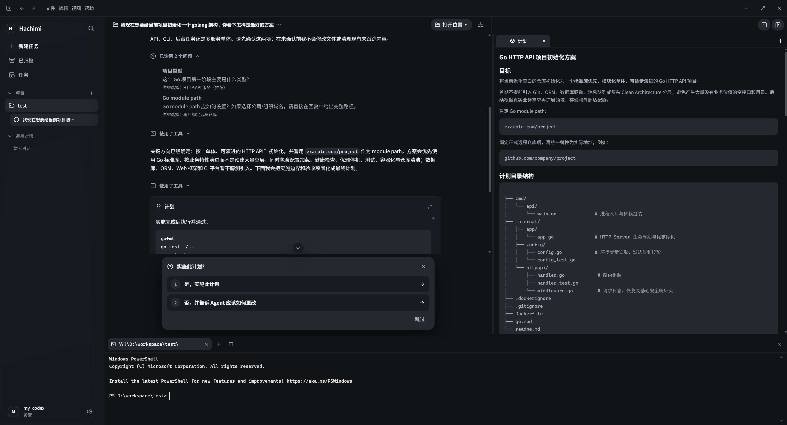
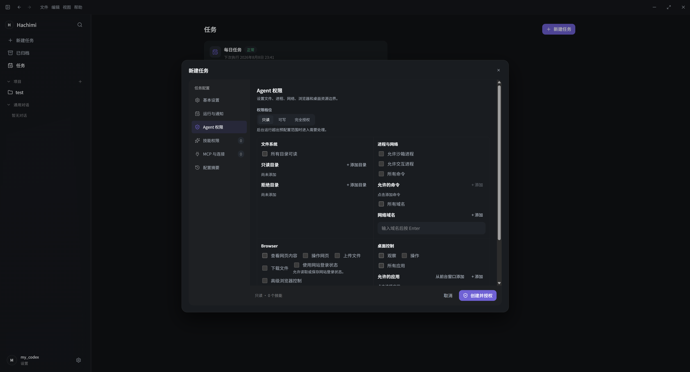
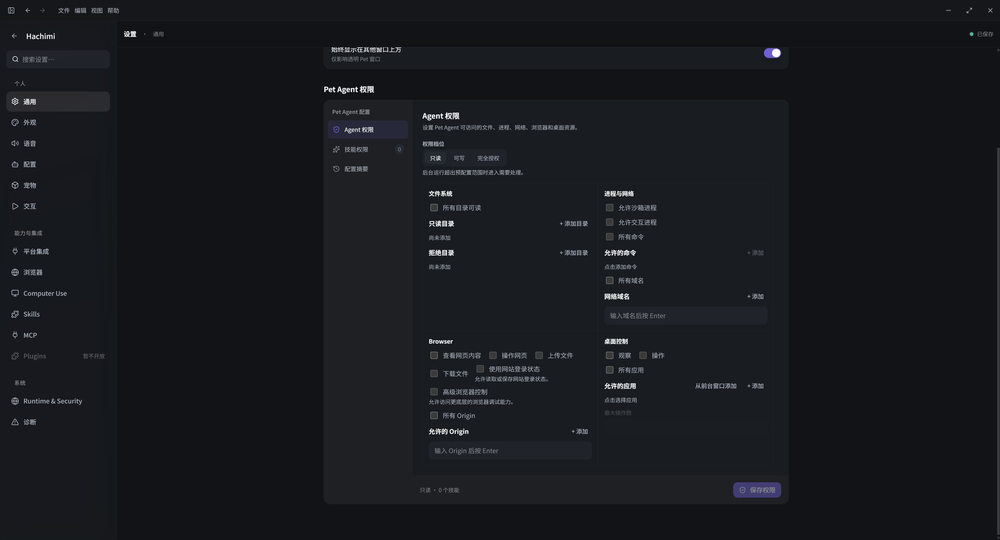

# Hachimi Desktop

Hachimi 是一个 Windows 先行的本地桌面 Agent 和透明 3D 桌宠。它把对话、项目工作区、工具调用、定时任务和桌宠交互放在同一个 Runtime 中，使用 Tauri 2、Rust、SolidJS、Three.js 和 three-vrm 构建。

当前版本是 `0.3.0-alpha.8` 开发预览版，尚未创建 tag 或发布正式安装包。源码采用 Apache-2.0；官方预编译包包含默认 VRM，默认 VRM 的资源许可限制见 [NOTICE](NOTICE.md)。

## 界面预览

### 工作台

工作台提供项目、Session、Run、计划、文件、终端和右侧 Inspector，适合持续的编码与办公任务。



### 桌宠与模型

桌宠窗口保持透明、置顶，可直接进行文字或语音对话；VRM 模型、动作和语音资源可在设置中切换。

<p align="center">
  
</p>

### 定时任务

任务中心支持一次性、周期、Cron 和事件触发任务，并显示权限、运行状态、历史记录和需要处理的任务。



### 权限与设置

统一设置页管理模型、语音、外观、Skills、MCP、浏览器、Computer Use 和 Agent 权限。工具权限按文件、进程、网络、浏览器和桌面资源收敛。



## 当前能力

- **统一 Agent Runtime**：持久化 Session、Run、Transcript Item、Approval、UserInput、Compaction、恢复、后台任务和 Artifact；Pet 与 Workbench 共用同一执行链。
- **项目工作区**：文件树、编辑器、搜索、watch、Diff/Review、Terminal、Git 分支、stage、commit、compare 和 push。
- **模型与工具**：OpenAI-compatible Chat Completions、Responses、Embeddings；Skills、MCP stdio、HTTPS/loopback HTTP、OAuth 和统一 Tool Orchestrator。API Key 使用 Windows Credential Manager 保存。
- **浏览器与桌面控制**：内置 CEF Workspace、外部 Chrome observation、接管/恢复、站点权限、下载，以及 Computer Observe/Act 和应用规则。高完整性桌面与真实 Profile 仍需 Windows Gate 验证。
- **定时任务**：At、Every、Cron、Event、独立 Session 或共享 Session、Worktree、权限、Skills/MCP/Connector、重试、停止条件、通知和重启 reconciliation。后台 Browser upload 当前会明确返回不支持。
- **桌宠、模型与语音**：VRM 0.x/1.0 检测导入、VRMA 动作库与重定向、口型/注视/SpringBone、SenseVoice-Small 离线识别和 sherpa-onnx VITS/MeloTTS 离线合成。
- **平台集成**：内置 5 个 Channel provider：钉钉、飞书、企业微信 AI Bot、企业微信自建应用和微信 iLink；企业微信、钉钉、飞书的 API/消息账户在“平台集成”统一配置。真实账号、组织和回调 Gate 尚未执行。
- **内置扩展运行时**：内置 Bundle 的生命周期、权限和崩溃恢复由 Runtime 承载；用户 Plugins 管理入口当前未开放。

实现状态和后续缺口以 [路线图](docs/ROADMAP.md) 为准。代码已完成不等于真实外部服务或 Windows 发布 Gate 已通过。

## 快速开始

开发环境：Windows 11、WebView2、Rust `1.97.1`、Node.js `24.10.x`、pnpm `11.15.1` 和 Git LFS。

```powershell
git lfs install
git lfs pull
corepack enable
corepack pnpm install --frozen-lockfile
corepack pnpm dev
```

语音模型或默认资源缺失时，可以运行：

```powershell
corepack pnpm models:prepare
```

VRM、VRMA 和 sherpa-onnx 模型的格式、大小与许可要求见 [3D 角色模型指南](docs/AVATAR_MODEL_GUIDE.md)。

## 检查与测试

完整本地检查入口：

```powershell
corepack pnpm check
```

首次执行视觉检查前安装固定浏览器：

```powershell
corepack pnpm --filter @hachimi/ui exec playwright install chromium
```

按需执行真实环境 Gate：

```powershell
corepack pnpm test:staging:openai
corepack pnpm test:staging:enterprise
corepack pnpm test:staging:channels
corepack pnpm test:windows:standard-user
corepack pnpm test:windows:release
```

缺少受保护凭据、真实组织或指定 Windows 身份时，Gate 会 fail closed；fixture 和 mock 只证明本地实现。

## 构建

```powershell
corepack pnpm build:installer
corepack pnpm build:portable
```

MSI/NSIS 输出到 `target/release/bundle/`，便携包输出到 `target/portable/Hachimi-portable.zip`。

## 文档索引

- [路线图与功能缺口](docs/ROADMAP.md)
- [统一 Agent 架构](docs/HARNESS_AGENT_ARCHITECTURE_AND_IMPLEMENTATION.md)
- [AI 实施规格](docs/HACHIMI_AI_IMPLEMENTATION_SPEC.md)
- [代码实施计划](docs/HARNESS_AGENT_CODE_IMPLEMENTATION_PLAN.md)
- [来源与参考登记](docs/HARNESS_AGENT_SOURCE_PROVENANCE.md)
- [Workbench Windows 验收](docs/WORKBENCH_WINDOWS_VALIDATION.md)
- [发布 Gate](docs/RELEASE_GATES.md)
- [VRM 模型指南](docs/AVATAR_MODEL_GUIDE.md)

## 本地数据

Debug 默认使用 `target/hachimi-data`；便携版使用程序同级 `data`；安装版使用 `%APPDATA%/com.hachimi.desktop`。可通过 `HACHIMI_DATA_DIR` 指定数据根目录。API Key 不会明文写入这些目录，重置数据会同时清理本地凭据。

## 许可

源代码使用 Apache-2.0。默认 VRM、内置 VRMA、语音模型、ONNX Runtime 和 DirectML 的来源与许可见 [NOTICE](NOTICE.md) 及 `apps/desktop/src-tauri/resources/ai-models/THIRD-PARTY-NOTICES.md`。
