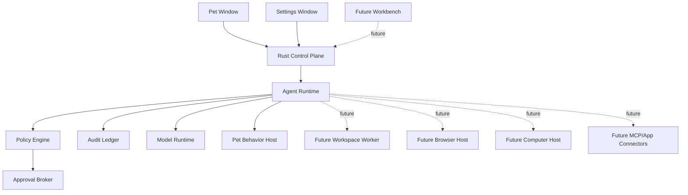

# Hachimi 跨平台 AI 3D 桌宠——AI 实现规格

> 文档状态：Draft v0.5
> 更新日期：2026-07-24
> 目标读者：AI 编码代理、客户端工程师、Rust 工程师、3D 技术美术
> 规范关键词：`必须`、`禁止`、`应该`、`可以`分别表示 MUST、MUST NOT、SHOULD、MAY

> 语音架构更新（协议 v11 / Settings v7）：GPT-SoVITS、Python、PyTorch、
> 本地 HTTP 服务和旧语音配置均已移除。STT 与 TTS 统一使用 k2-fsa 官方
> `sherpa-onnx 1.13.4` Rust crate；SenseVoice-Small 改为 App Data 按需安装，
> 不进入初始安装包。VITS 按 LLM 完整短句流水线合成，并以实际 PCM 播放
> 时钟同步字幕和口型。内置中英双语 MeloTTS 模型采用 MIT 许可证。

## 1. 文档目的

本文档是 Hachimi 第一版桌面应用的产品与技术实施基线。实现者应当按本文档搭建仓库、划分模块、定义协议、实现 MVP，并使用验收标准判断阶段是否完成。

本文档不是概念讨论。除“待确认事项”明确标注的内容外，本文档中的技术决策均视为默认决策。AI 编码代理不得在未记录理由的情况下替换核心技术栈或合并安全边界。

### 1.1 当前实现快照（2026-07-24）

当前仓库已在 Phase 0/1 窗口验证之上实现 Workbench UI 壳和设置中心：

- 生产 Web 入口为 `pet.html` 与 `workbench.html`，不再创建独立 Settings 窗口；
- Workbench 是单例普通窗口，包含静态项目/会话主页、禁用发送的临时草稿框，以及通用、LLM、3D 模型、语音模型五个内部路由；
- Pet 的工作台、LLM、3D 模型和语音菜单均打开同一窗口并深链到固定路由；
- LLM 非敏感配置写入 Settings Schema v2，API Key 只保存在系统 Keyring；Rust 可执行固定提示的 OpenAI-compatible 连接测试；
- 不读取 `OLLAMA_*` 环境变量，它们只曾作为参考项目的字段来源，不是 Hachimi 的运行时配置源；
- Avatar Motion Runtime V4 只接受 Detector 4 判定为 Runtime Ready 的 VRM 0.x/1.0，使用 `AvatarAdaptationProfile` 和动态 Motion Catalog 重定向正式 VRMA 1.0；旧动作包、固定行为协议和旧绑定不读取；语音输入使用安装包内置的 SenseVoice-Small，输出使用原生 sherpa-onnx VITS，并支持安全导入 VITS `.tar.bz2`；
- `FeatureFlags.workbench=true` 只代表 UI 壳可用。Workspace、Shell、Git、Browser、Computer、Connector、Agent、Monaco、xterm 和消息发送仍未注册、未授权且默认关闭。

本节描述已交付代码；后文标为 MVP 的 3D 渲染、宠物聊天和本地 TTS 仍是产品路线目标，不能据此宣称已经实现。

## 2. 产品愿景

用户安装并启动应用后，桌面立即出现一个透明背景的 3D 宠物。用户可以：

- 左键点击宠物，在宠物下方打开文字输入框；
- 输入文字并发送给 OpenAI-compatible/Ollama 大语言模型；
- 看到模型的流式文字回复；
- 让大模型通过受限 Tool Call 控制宠物说话、表情、注视、动作和移动；
- 右键宠物打开上下文菜单；
- 在菜单中进入“大语言模型设置”“3D 模型设置”“语音设置”；
- 上传通过 Runtime Ready 严格检测的 VRM 0.x/1.0 并替换当前宠物；
- 从右键菜单进入类似 OpenCode 的工作台 UI 壳；编程 Agent 能力在未来接入。

产品必须让用户感觉宠物生活在桌面上，而不是打开了一款带背景的普通 3D 应用。

## 3. 第一版范围

### 3.1 必须实现

- Windows、macOS、Linux X11 的桌面安装包或可安装制品；
- 透明、无边框、可置顶的桌宠窗口；
- 模型区域可点击，窗口透明空白区域尽可能鼠标穿透；
- 默认内置一个具有合法分发授权的 Runtime Ready VRM 模型；
- VRM 0.x/1.x 运行时加载；
- 普通 GLB、非标准 Humanoid 与未通过 Detector 4 的 VRM 拒绝导入；
- 动态 VRMA Motion Catalog、切换惯性化、接触/IK/关节限制/碰撞和 120Hz SpringBone；
- 动画淡入淡出、表情、LookAt 和基础口型；
- 左键输入框、流式回复气泡、右键菜单；
- 大语言模型、3D 模型、语音三个设置页面；
- Rust 发起 OpenAI-compatible `/chat/completions` 流式请求；
- 纯文字响应和宠物行为 Tool Call；
- 无跨轮次聊天上下文，每次发送独立请求；
- API Key 使用系统安全凭据存储；
- 错误提示、连接测试、请求取消和基本日志；
- 中英文界面基础设施，第一版至少提供 `zh-CN` 和 `en-US`。

### 3.2 第一版明确不做

- 不实现聊天历史、长期记忆、向量检索；
- 不实现工作台的文件、终端、Git、MCP 和编程 Agent；
- 不实现屏幕捕获、浏览器控制、桌面控制或第三方软件自动化；
- 不实现服装切换或部件换装；
- 不支持普通 GLB、非人形模型或能力不完整的 VRM 新导入；
- 不实现语音唤醒和 STT；
- 不让宠物聊天获得文件系统、终端或系统命令工具；
- 不保证所有 Wayland 合成器具有与 Windows 相同的窗口能力；
- 不加载模型中指向互联网的外部资源；
- 不允许 LLM 直接执行 JavaScript、Rust、Shell 或骨骼路径表达式；
- 不在第一版实现用户自定义主题市场或插件系统。

### 3.3 功能全景与交付状态

本节是功能索引，方便产品、设计、开发和 AI 编码代理快速判断交付边界。状态含义：

| 标记           | 含义                                                             |
| -------------- | ---------------------------------------------------------------- |
| **MVP**        | 第一版必须实现并通过对应验收；未完成不能宣称 MVP 完成            |
| **MVP SHOULD** | 第一版应该实现；如因平台限制后置，必须记录原因和替代入口         |
| **未来**       | 架构已预留但不属于 MVP；默认关闭，不得注册隐藏工具或提前请求权限 |
| **范围外**     | 当前没有实现承诺，或明确不支持/不保证                            |

#### 3.3.1 安装、窗口与桌面体验

| 功能                   | 状态           | 说明                                         |
| ---------------------- | -------------- | -------------------------------------------- |
| Windows 安装包         | **MVP**        | 安装后直接启动，不依赖开发环境               |
| macOS 签名、公证安装包 | **MVP**        | 首版面向网站分发                             |
| Linux AppImage         | **MVP**        | X11 是首要目标                               |
| Linux deb 包           | **MVP SHOULD** | AppImage 之外的推荐制品                      |
| 透明、无边框桌宠窗口   | **MVP**        | 不显示普通应用背景                           |
| 窗口置顶               | **MVP**        | 可由用户配置                                 |
| 模型命中区域可交互     | **MVP**        | 点击模型有效                                 |
| 透明区域鼠标穿透       | **MVP**        | 按平台能力精确命中或动态切换                 |
| 宠物拖动和窗口移动     | **MVP**        | 支持多显示器、DPI/Retina 和负坐标            |
| 宠物在桌面行走         | **MVP**        | 3D 走路动画与小型窗口位置同步                |
| 启动时恢复宠物位置     | **MVP**        | 显示器变化时纠正到可见区域                   |
| 系统托盘和退出入口     | **MVP SHOULD** | 即使无托盘也必须始终存在明确退出入口         |
| Light/Dark/跟随系统    | **MVP**        | 所有窗口共享主题 Token                       |
| 中英文界面             | **MVP**        | 至少 `zh-CN`、`en-US`                        |
| Wayland 完整窗口能力   | **范围外**     | 明确展示降级，不保证任意位置、置顶和穿透一致 |
| Mac App Store 分发     | **范围外**     | 首版不承诺                                   |
| 自动更新               | **未来**       | MVP 只要求版本和配置迁移机制存在             |

#### 3.3.2 3D 模型、动画与角色表现

| 功能                           | 状态       | 说明                                  |
| ------------------------------ | ---------- | ------------------------------------- |
| 内置默认 3D 角色               | **MVP**    | 必须具有合法分发授权                  |
| VRM 0.x/1.x 导入               | **MVP**    | 优先保证 VRM 1.0                      |
| 严格 Runtime Ready VRM 导入    | **MVP**    | VRM 0.x/1.0，全部强制能力通过         |
| 模型预览和切换                 | **MVP**    | 新模型失败时保留旧模型                |
| 模型能力检测和兼容性报告       | **MVP**    | 显示骨骼、动作、表情和口型支持情况    |
| 模型大小、纹理和复杂度限制     | **MVP**    | 在 Rust 导入阶段校验                  |
| MToon/常用 glTF 材质           | **MVP**    | 透明背景下正确渲染                    |
| Humanoid 动作重定向            | **MVP**    | VRM0/VRM1 Normalized Humanoid         |
| 12 个固定动态行为              | **MVP**    | 内置程序与八个 VRMA 内核              |
| 动画混合、淡入淡出和状态机     | **MVP**    | 避免动作突变和竞争                    |
| 表情控制                       | **MVP**    | 使用受限语义表情名                    |
| LookAt/注视控制                | **MVP**    | 不能接受任意骨骼表达式                |
| VRM SpringBone                 | **MVP**    | 对支持的模型启用                      |
| 基础口型                       | **MVP**    | 与 TTS 播放状态同步                   |
| 普通 GLB/非人形模型运行        | **范围外** | 不导入、不重定向、不猜测骨骼名称      |
| 可选能力降级                   | **MVP**    | 缺胸、脚趾、手指、LookAt 时降低自由度 |
| 服装切换、拆件和换装           | **范围外** | 当前产品不做                          |
| 运行时从互联网加载模型外部资源 | **范围外** | 出于离线性、供应链和隐私安全禁止      |

#### 3.3.3 宠物交互与界面

| 功能                   | 状态     | 说明                                           |
| ---------------------- | -------- | ---------------------------------------------- |
| 左键点击宠物打开输入框 | **MVP**  | 输入框显示在宠物下方                           |
| 提交文字消息           | **MVP**  | 支持键盘提交和取消                             |
| 流式文字气泡           | **MVP**  | 不阻塞 3D 渲染                                 |
| 请求中状态与停止按钮   | **MVP**  | 停止后忽略迟到事件                             |
| 右键模型上下文菜单     | **MVP**  | 使用统一设计系统组件                           |
| 大语言模型设置         | **MVP**  | 配置、保存并测试连接                           |
| 3D 模型设置            | **MVP**  | 导入、预览、能力报告和切换                     |
| 语音设置               | **MVP**  | TTS 配置和试听                                 |
| 工作台 UI 壳           | **MVP**  | 已可打开；静态主页和设置中心可用，编程能力关闭 |
| 错误提示和诊断入口     | **MVP**  | Pet 只显示简短错误，详情进入设置页             |
| UI Lab/组件视觉回归    | **MVP**  | 统一 Button、Input、Menu、Dialog 等组件        |
| 用户主题市场           | **未来** | 不属于 MVP，启用前需定义 Schema 与资源安全规则 |

#### 3.3.4 LLM 与宠物行为 Agent

| 功能                              | 状态       | 说明                                                       |
| --------------------------------- | ---------- | ---------------------------------------------------------- |
| Ollama/OpenAI-compatible Provider | **MVP**    | Rust 请求 `/chat/completions`                              |
| OpenAI-compatible 接口地址配置    | **MVP**    | 仅由设置页管理，不读取 `OLLAMA_*` 环境变量                 |
| API Key 安全保存                  | **MVP**    | 使用系统 Keyring，不进入 WebView                           |
| 模型名称配置字段                  | **MVP**    | 当前只用于 OpenAI-compatible 连接测试                      |
| 最大输入/输出 Token 配置          | **MVP**    | `0` 表示由服务端决定                                       |
| LLM 连接测试                      | **MVP**    | 错误必须可理解且不泄露密钥                                 |
| SSE 流式解析                      | **MVP**    | 支持文本、Tool Call delta、取消和断线                      |
| 纯文字回答                        | **MVP**    | 展示为宠物气泡                                             |
| 宠物行为 Tool Call                | **MVP**    | 只能调用白名单中的宠物动作组合工具                         |
| 文字、动作、表情、注视和移动组合  | **MVP**    | Rust 与前端双重参数验证                                    |
| 动态 Tool Schema                  | **MVP**    | 仅暴露当前 Avatar 真正支持的能力                           |
| 不支持 Tool Call 时降级           | **MVP**    | 仍能正常进行纯文字聊天                                     |
| Stateless Pet Turn                | **MVP**    | 每次只发送 System + 当前 User，不发送历史                  |
| 请求取消与超时                    | **MVP**    | 每个 Run 使用 CancellationToken                            |
| 宠物聊天历史                      | **范围外** | MVP 不保存、不发送；未来是否提供需另行立项                 |
| 宠物长期记忆/向量检索             | **范围外** | 当前无实现承诺                                             |
| 图片/屏幕多模态宠物对话           | **未来**   | 需要多模态 Provider adapter 和独立隐私授权                 |
| 通用多轮 Agent Tool Loop          | **未来**   | 首先服务工作台和 Computer Use，不向 Pet 自动开放高权限工具 |

#### 3.3.5 语音

| 功能                                | 状态       | 说明                                               |
| ----------------------------------- | ---------- | -------------------------------------------------- |
| 本地离线 TTS Runtime                | **MVP**    | Rust 进程内调用 sherpa-onnx VITS，不依赖 Python    |
| 内置中英双语女声                    | **已实现** | MeloTTS float32，MIT 许可                          |
| VITS 模型导入                       | **MVP**    | 两阶段安全导入 `.tar.bz2`，支持中英与多说话人模型  |
| Windows DirectML                    | **MVP**    | 实际 Session/热身成功才启用，否则回退 CPU          |
| 本地模型随安装包分发                | **MVP**    | 不在首次说话时临时联网下载                         |
| 句子级流式朗读                      | **MVP**    | 第一完整短句合成后开始播放                         |
| 字幕、语音与口型同步                | **MVP**    | 使用同一 PCM 播放时钟和 20ms RMS 包络              |
| TTS 播放取消                        | **MVP**    | 新请求或 stop 可中断                               |
| TTS 失败降级为文字                  | **MVP**    | 不影响后续聊天                                     |
| OpenAI-compatible 远程 TTS Provider | **未来**   | 参考 `/audio/speech`，与本地 Provider 使用同一接口 |
| 远程 TTS Base URL/API Key 配置      | **未来**   | 密钥由 Rust Keyring 保存                           |
| 语音输入/STT                        | **MVP**    | 安装包内置 SenseVoice-Small INT8                   |
| 语音唤醒                            | **未来**   | 需要麦克风权限、误唤醒和常驻隐私设计               |
| 高品质音素级口型                    | **未来**   | MVP 只要求基础音量/viseme 口型                     |

#### 3.3.6 工作台与编程 Agent

Workbench UI 壳与设置中心已经进入生产 Bundle；以下编程能力仍全部是 **未来**：

| 功能                           | 状态     | 说明                                             |
| ------------------------------ | -------- | ------------------------------------------------ |
| 类 OpenCode/Codex 工作台 UI 壳 | **MVP**  | SolidJS 静态主页、内部设置路由、自绘窗口；已实现 |
| 持久 Session 和多轮 Transcript | **未来** | 与 Stateless Pet Agent 分离                      |
| Context Compaction             | **未来** | 仅用于长会话 Agent                               |
| Workspace 选择和授权           | **未来** | 禁止默认把整个 Home 当 Workspace                 |
| 文件读取、搜索与编辑           | **未来** | 受 Workspace root、Scope、Policy 和 Sandbox 限制 |
| Git 状态、Diff 与操作          | **未来** | 有副作用的操作按风险审批                         |
| Shell/命令执行                 | **未来** | 在独立 Workspace Worker 中执行                   |
| PTY/交互终端                   | **未来** | 不运行在 WebView 或 Tauri command 内             |
| 编程 Agent Tool Loop           | **未来** | 支持审批、取消、事件流和串行 Run lane            |
| MCP/App Connector              | **未来** | 结构化工具优先于视觉桌面操作                     |
| OS 强制 Workspace Sandbox      | **未来** | 路径校验本身不能称为 Sandbox                     |
| 按 Workspace 控制网络访问      | **未来** | 默认无网络，按目标显式开放                       |

#### 3.3.7 浏览器、桌面与第三方软件控制

以下均为高权限 **未来** 能力，默认 Feature Flag 为 false：

| 功能                                 | 状态       | 说明                                            |
| ------------------------------------ | ---------- | ----------------------------------------------- |
| 独立 Browser Host                    | **未来**   | 使用独立 Profile，不复用日常浏览器登录态        |
| 浏览器导航和 DOM 操作                | **未来**   | Domain Policy、Approval 与下载隔离              |
| 浏览器截图/视觉 fallback             | **未来**   | 优先使用 DOM/CDP 或结构化 API                   |
| 下载隔离与不可信内容处理             | **未来**   | 下载不能直接变为系统指令或可执行输入            |
| Computer Observe                     | **未来**   | 屏幕捕获、窗口列表、Accessibility Tree          |
| Computer Act                         | **未来**   | 鼠标、滚动、键盘和文本输入                      |
| Windows UI Automation                | **未来**   | 输入 fallback 使用受限 SendInput                |
| macOS Accessibility/ScreenCaptureKit | **未来**   | 需要单独 TCC 权限                               |
| Linux AT-SPI/Portal/PipeWire/X11     | **未来**   | Wayland 能力按 compositor 明确降级              |
| Frame-bound 坐标动作                 | **未来**   | 绑定 Frame、Display、几何和有效期               |
| Observe → Act → Observe 循环         | **未来**   | 每次 Computer Tool Call 最多一个动作            |
| App/窗口目标 Allowlist               | **未来**   | 目标切换不确定时 fail closed                    |
| 桌面控制临时 Arming/Lease            | **未来**   | 默认 10 分钟                                    |
| 用户接管自动暂停                     | **未来**   | 检测到用户输入立即暂停 Agent                    |
| 可见控制状态条                       | **未来**   | 显示目标 App、状态和剩余授权时间                |
| 暂停、接管、停止                     | **未来**   | 控制期间必须始终可达                            |
| 全局 Emergency Stop                  | **未来**   | 同时提供托盘停止入口                            |
| 按风险逐次 Approval                  | **未来**   | 发送、修改、支付、删除等不能由 LLM 自批         |
| Prompt Injection 隔离                | **未来**   | 屏幕、网页、文件和工具结果均视为不可信内容      |
| 第三方软件结构化 Connector           | **未来**   | 优先于截图坐标控制                              |
| 可选远程 Capability Node             | **未来**   | 仅在明确立项后实现配对、TLS/VPN 和 scoped token |
| 公网暴露桌面控制端口                 | **范围外** | 明确禁止作为部署方式                            |
| 自动批准管理员权限或系统隐私权限     | **范围外** | 永久禁止                                        |
| 通过 GUI 终端绕过 Workspace Policy   | **范围外** | 永久禁止                                        |
| 后台无提示持续控制桌面               | **范围外** | 永久禁止                                        |

#### 3.3.8 配置、隐私与安全基础设施

| 功能                                 | 状态     | 说明                                         |
| ------------------------------------ | -------- | -------------------------------------------- |
| JSON 本地配置                        | **MVP**  | 使用版本号和迁移机制                         |
| 系统 Keyring                         | **MVP**  | 保存 LLM API Key；未来也保存远程 TTS API Key |
| Rust 统一网络出口                    | **MVP**  | WebView 不直接请求 LLM/TTS                   |
| CSP 和本地资产协议                   | **MVP**  | 禁止从 CDN 加载代码、字体、模型和动作        |
| 结构化日志与敏感字段脱敏             | **MVP**  | 不记录 API Key 和完整 Prompt                 |
| 默认无遥测                           | **MVP**  | 用户数据不自动上传                           |
| Control Plane 协议边界               | **MVP**  | 先使用内嵌 `InProcessTransport`              |
| Policy/Approval/Capability mock 契约 | **MVP**  | 先测试未来能力的拒绝路径                     |
| 高权限 Feature Flags 全关闭          | **MVP**  | 不注册 Tool、不启动 Helper、不请求 OS 权限   |
| Approval Broker                      | **未来** | 绑定 Run、Tool、Target、参数哈希和有效期     |
| Capability Host Audit 元数据         | **未来** | 不保存截图、Prompt、原始工具内容或凭据       |
| 本地独立 Helper 进程                 | **未来** | 使用 Named Pipe/Unix Domain Socket           |
| 远程设备配对与身份                   | **未来** | 不以 Session ID 或共享 token 代替身份        |
| 插件/Connector 市场                  | **未来** | 需要签名、权限声明、审查和撤销机制           |

## 4. 核心技术决策

| 领域           | 决策                                                                    |
| -------------- | ----------------------------------------------------------------------- |
| 桌面框架       | Tauri 2                                                                 |
| 本地后端       | Rust 2024 Edition                                                       |
| 前端语言       | TypeScript                                                              |
| UI 框架        | SolidJS                                                                 |
| Headless UI    | Kobalte                                                                 |
| 3D 引擎        | Three.js，使用 WebGL2                                                   |
| VRM            | `@pixiv/three-vrm` 及其动画相关包                                       |
| 模型加载       | Three.js `GLTFLoader` + three-vrm；GLB 只作为 VRM 二进制容器            |
| 构建           | Cargo Workspace + pnpm Workspace + Vite 多页面构建                      |
| 前端测试       | Vitest + Playwright + UI Lab/Stories                                    |
| Rust 测试      | `cargo test` + Clippy                                                   |
| 配置           | JSON；未来业务数据使用 SQLite                                           |
| 密钥           | Rust `keyring` 对接系统凭据服务                                         |
| 网络           | Rust `reqwest` + `tokio`，前端禁止直接请求 LLM                          |
| 本地 TTS       | Rust 进程内调用 `sherpa-onnx` VITS C API，`rodio` 播放 PCM              |
| 未来远程 TTS   | OpenAI-compatible `/audio/speech` Provider adapter                      |
| 前后端流式通信 | Tauri Channel；普通控制使用 Command/Event                               |
| 工作台 UI 壳   | SolidJS；Monaco Editor、xterm.js、Agent 和 Workspace 工具未来再接入     |
| Agent 控制面   | Rust `hachimi-control-plane`，MVP 内嵌，未来可迁移到本地 daemon         |
| 高权限执行     | 独立 Capability Host；默认不存在、未授权、未 armed                      |
| 权限模型       | 身份/Scope、Tool Policy、Sandbox、Approval、OS Permission、临时授权分层 |

选择 SolidJS 而不是 React 的原因：工作台 UI 壳已经使用 SolidJS 实现，OpenCode 的应用层和 UI 包也证明 SolidJS、Kobalte、独立设计系统包和复杂 Agent 状态可以共同工作。Three.js 渲染循环必须保持为独立的命令式模块，不依赖 Solid 组件每帧更新。

核心前端依赖建议：

```text
solid-js
@kobalte/core
@tauri-apps/api
three
@pixiv/three-vrm
@pixiv/three-vrm-animation
zod
Solid 原生 store
```

核心 Rust 依赖建议：

```text
tauri
tokio
tokio-util
reqwest
serde / serde_json
futures-util
thiserror
tracing / tracing-subscriber
secrecy
keyring
sherpa-onnx
hound
sha2
gltf
url
specta / tauri-specta
```

所有依赖必须在 lockfile 中锁定。禁止运行时从 CDN 下载 JavaScript 依赖。

## 5. 参考 OpenCode 的结论

参考仓库：<https://github.com/anomalyco/opencode>  
研究快照：commit `0a601cf334b9a83cc2854108a2b860f25e6e7e8e`

稳定参考定位：

- [独立 UI package](https://github.com/anomalyco/opencode/tree/0a601cf334b9a83cc2854108a2b860f25e6e7e8e/packages/ui)
- [Primitive 色阶](https://github.com/anomalyco/opencode/blob/0a601cf334b9a83cc2854108a2b860f25e6e7e8e/packages/ui/src/v2/styles/colors.css)
- [Semantic Theme](https://github.com/anomalyco/opencode/blob/0a601cf334b9a83cc2854108a2b860f25e6e7e8e/packages/ui/src/v2/styles/theme.css)
- [Theme JSON Schema](https://github.com/anomalyco/opencode/blob/0a601cf334b9a83cc2854108a2b860f25e6e7e8e/packages/ui/src/theme/desktop-theme.schema.json)
- [Button 实现、data attributes 和 variants](https://github.com/anomalyco/opencode/blob/0a601cf334b9a83cc2854108a2b860f25e6e7e8e/packages/ui/src/v2/components/button-v2.tsx)
- [Button 组件样式](https://github.com/anomalyco/opencode/blob/0a601cf334b9a83cc2854108a2b860f25e6e7e8e/packages/ui/src/v2/components/button-v2.css)
- [Button stories](https://github.com/anomalyco/opencode/blob/0a601cf334b9a83cc2854108a2b860f25e6e7e8e/packages/ui/src/v2/components/button-v2.stories.tsx)
- [应用层统一样式入口](https://github.com/anomalyco/opencode/blob/0a601cf334b9a83cc2854108a2b860f25e6e7e8e/packages/app/src/index.css)

本项目只参考其前端设计系统和复杂工作台的组织方式，不复制其品牌、页面和桌面运行时。OpenCode 当前桌面壳为 Electron；Hachimi 因 Rust 后端和轻量常驻要求，继续使用 Tauri 2。

需要吸收的模式：

1. UI 作为独立包，不把基础组件散落在业务页面中；
2. 原始色阶与语义 token 分离；
3. Light/Dark 主题由统一 Context 和数据属性控制；
4. 组件通过 `data-component`、`data-variant`、`data-size`、`data-state` 暴露稳定样式接口；
5. 组件实现、组件 CSS、stories/UI Lab 示例并列存在；
6. Kobalte 提供可访问的 Dialog、Menu、Select、Tooltip 等基础行为；
7. 应用层通过 Context/Store 组合业务，不在基础组件中加入 LLM 或模型逻辑；
8. 设置、终端、标签页、文件状态等领域拥有独立上下文；
9. 主题具有 JSON Schema，可以同时表达明暗变体和覆盖项；
10. 用户可见文案集中进入 i18n，不散落硬编码。

Hachimi 不采用 OpenCode 仓库中的 `v2` 过渡命名。Hachimi 从第一天只维护一套稳定设计系统。

## 6. 进程、窗口和运行模型

应用正常运行时只有一个 Tauri/Rust 主进程和系统 WebView 运行时，不启动 localhost Python 服务。

### 6.1 窗口类型

```rust
pub enum WindowKind {
    Pet,
    Settings,
    Workbench,
}
```

#### Pet 窗口

- 标签固定为 `pet`；
- 启动时立即创建并显示；
- 透明、无边框、默认置顶、不显示在任务栏；
- 加载 `pet.html`；
- 只包含 Three.js、宠物输入框、气泡和右键菜单；
- 不加载设置页面和未来工作台资源；
- 窗口大小随模型、输入框和气泡的可见范围调整；
- Rust 是全局窗口位置和显示器信息的权威来源。

#### Settings 窗口（保留类型，不创建）

- `WindowKind::Settings` 为协议兼容和权限测试保留；
- 生产构建不再包含 `settings.html`，运行时禁止创建独立 Settings 窗口；
- 所有设置页面统一位于 Workbench 内部路由。

#### Workbench 窗口

- 标签固定为 `workbench`；
- 全局只创建一个实例，默认 `1280×800`、最小 `960×640`；
- 加载 `workbench.html`，关闭时隐藏而不退出 Pet 或主进程；
- 使用自绘标题栏，支持拖动、八方向缩放、最小化、最大化和关闭；
- 当前包含静态主页与通用、LLM、3D、语音设置路由；
- 禁止为 UI 壳引入 Monaco、xterm.js、Workspace、Shell、Git 或 Computer 权限。

### 6.2 启动和退出

1. Rust 初始化日志、配置、密钥服务和窗口控制器；
2. 加载最后一次有效模型；失败则加载默认模型；
3. 创建 Pet 窗口；
4. 宠物即使未配置 LLM 也必须可以待机和响应点击；
5. 退出必须取消活跃请求、保存窗口位置、停止语音并安全释放模型资源；
6. Workbench 窗口关闭不能导致主进程退出；
7. 系统托盘为 SHOULD，第一阶段可以后置，但退出命令必须始终可达。

## 7. 仓库结构

```text
hachimi-code/
├── Cargo.toml
├── Cargo.lock
├── package.json
├── pnpm-lock.yaml
├── pnpm-workspace.yaml
├── rust-toolchain.toml
├── apps/
│   └── desktop/
│       ├── src-tauri/
│       │   ├── Cargo.toml
│       │   ├── tauri.conf.json
│       │   ├── capabilities/
│       │   └── src/
│       └── web/
│           ├── pet.html
│           ├── workbench.html
│           └── vite.config.ts
├── packages/
│   ├── ui/
│   ├── contracts/
│   ├── pet/
│   ├── settings/
│   ├── workbench/
│   └── i18n/
├── crates/
│   ├── hachimi-core/
│   ├── hachimi-protocol/
│   ├── hachimi-control-plane/
│   ├── hachimi-llm/
│   ├── hachimi-agent/
│   ├── hachimi-policy/
│   ├── hachimi-approvals/
│   ├── hachimi-capabilities/
│   ├── hachimi-audit/
│   ├── hachimi-sandbox/
│   ├── hachimi-avatar/
│   ├── hachimi-behavior/
│   ├── hachimi-voice/
│   ├── hachimi-storage/
│   ├── hachimi-windowing/
│   ├── hachimi-workbench/
│   ├── hachimi-browser/
│   └── hachimi-computer/
├── assets/
│   ├── avatars/
│   ├── animations/
│   └── icons/
├── fixtures/
│   ├── avatars/
│   └── llm-streams/
└── docs/
    └── HACHIMI_AI_IMPLEMENTATION_SPEC.md
```

约束：

- `packages/ui` 禁止依赖 `packages/pet`、`packages/settings` 或 `packages/workbench`；
- `packages/contracts` 只保存可序列化协议类型和验证 schema；
- Rust 可序列化协议的权威来源是 `hachimi-protocol`，`packages/contracts` 包含其生成的 TypeScript；
- `hachimi-llm` 禁止依赖 Tauri；
- `hachimi-agent` 禁止直接操作窗口和 Three.js；
- `hachimi-control-plane` 禁止直接实现平台输入注入和 Shell；
- `hachimi-policy` 和 `hachimi-approvals` 禁止依赖具体 UI，实现通过 trait/事件交互；
- `hachimi-computer`、`hachimi-browser`、`hachimi-sandbox` 第一版只能提供关闭状态、接口和测试替身；
- `hachimi-workbench` 第一版只允许定义接口、类型和 feature flag；
- Tauri Commands 只做参数校验、权限校验和 service 调用；
- 页面组件不能直接读取 API Key。

## 8. 前端设计系统

### 8.1 分层

`packages/ui` 必须包含：

```text
packages/ui/src/
├── styles/
│   ├── reset.css
│   ├── primitives.css
│   ├── semantic.css
│   ├── typography.css
│   ├── motion.css
│   └── index.css
├── theme/
│   ├── context.tsx
│   ├── types.ts
│   ├── default-themes.ts
│   └── theme.schema.json
├── components/
├── icons/
├── stories/
└── index.ts
```

样式层顺序固定为：

```css
@layer reset, theme, base, components, utilities;
```

### 8.2 Token 层级

禁止组件直接依赖原始十六进制颜色。Token 分三层：

1. Primitive：灰阶、蓝、红、绿等原始色阶；
2. Semantic：背景、文本、边框、状态、焦点、浮层等语义；
3. Component：仅在基础语义不足时定义组件专属 token。

第一版默认 Primitive Palette：

```css
:root {
  --neutral-0: #ffffff;
  --neutral-50: #f7f8fa;
  --neutral-100: #eef0f3;
  --neutral-200: #e1e4e8;
  --neutral-300: #cdd1d7;
  --neutral-400: #aab0b8;
  --neutral-500: #858c96;
  --neutral-600: #68707b;
  --neutral-700: #4d545d;
  --neutral-800: #34393f;
  --neutral-900: #24282d;
  --neutral-950: #15171a;
  --blue-500: #6d8dff;
  --blue-600: #5575ee;
  --green-700: #248a52;
  --yellow-700: #a56c13;
  --red-600: #d54b52;
}
```

最少语义 token：

```css
:root {
  --color-bg-base: var(--neutral-0);
  --color-bg-subtle: var(--neutral-50);
  --color-bg-elevated: var(--neutral-0);
  --color-bg-floating: color-mix(in srgb, var(--neutral-0) 88%, transparent);
  --color-bg-accent: var(--blue-600);
  --color-text-base: var(--neutral-950);
  --color-text-muted: var(--neutral-700);
  --color-text-faint: var(--neutral-500);
  --color-text-inverse: var(--neutral-0);
  --color-border-muted: color-mix(in srgb, var(--neutral-950) 8%, transparent);
  --color-border-base: color-mix(in srgb, var(--neutral-950) 12%, transparent);
  --color-border-strong: color-mix(in srgb, var(--neutral-950) 22%, transparent);
  --color-border-focus: var(--blue-500);
  --color-state-success: var(--green-700);
  --color-state-warning: var(--yellow-700);
  --color-state-danger: var(--red-600);
  --color-overlay-hover: color-mix(in srgb, var(--neutral-950) 5%, transparent);
  --color-overlay-pressed: color-mix(in srgb, var(--neutral-950) 9%, transparent);
  --shadow-raised: 0 2px 6px rgb(0 0 0 / 8%);
  --shadow-floating: 0 8px 24px rgb(0 0 0 / 14%);
  --shadow-overlay: 0 16px 40px rgb(0 0 0 / 18%);
}
```

以上是默认浅色语义映射。深色模式必须重新映射语义 token，组件不得通过覆盖组件 CSS 来实现深色模式。

```css
html[data-color-scheme="dark"] {
  --color-bg-base: var(--neutral-950);
  --color-bg-subtle: var(--neutral-900);
  --color-bg-elevated: var(--neutral-900);
  --color-bg-floating: color-mix(in srgb, var(--neutral-900) 90%, transparent);
  --color-text-base: var(--neutral-100);
  --color-text-muted: var(--neutral-400);
  --color-text-faint: var(--neutral-500);
  --color-text-inverse: var(--neutral-950);
  --color-border-muted: rgb(255 255 255 / 8%);
  --color-border-base: rgb(255 255 255 / 12%);
  --color-border-strong: rgb(255 255 255 / 22%);
  --color-overlay-hover: rgb(255 255 255 / 6%);
  --color-overlay-pressed: rgb(255 255 255 / 10%);
  --shadow-raised: 0 2px 8px rgb(0 0 0 / 30%);
  --shadow-floating: 0 10px 28px rgb(0 0 0 / 42%);
  --shadow-overlay: 0 18px 48px rgb(0 0 0 / 50%);
}
```

必须同时定义：

- 字体族、字号、字重、行高；
- 4px 基础间距体系；
- `4/6/8/12/16px` 圆角；
- 控件高度 `28/32/36/40px`；
- Focus Ring；
- Z-index 层级；
- 动画时长和 easing；
- 浅色、深色和跟随系统模式。

推荐字体：

```css
--font-ui: Inter, "Noto Sans SC", system-ui, sans-serif;
--font-code: "JetBrains Mono", "Noto Sans Mono", monospace;
```

### 8.3 组件约定

基础组件必须使用稳定的数据属性：

```tsx
<button data-component="button" data-variant="primary" data-size="normal" data-state="idle" />
```

每个可复用组件应该具有：

```text
button.tsx
button.css
button.stories.tsx
button.test.tsx        # 行为复杂时必须
```

禁止：

- 在业务页面复制按钮、菜单、输入框样式；
- 在 JSX 中硬编码品牌色；
- 依靠随机 Tailwind class 组合形成组件视觉；
- 组件自己读取全局 LLM、模型或工作区状态；
- 使用无键盘交互的自制 Dialog/Menu 替代 Kobalte；
- 在一个组件中同时混入网络请求、存储和呈现逻辑。

### 8.4 MVP 组件清单

第一版必须优先完成以下基础组件：

- Button
- IconButton
- TextField
- PasswordField
- NumberField
- Select
- Slider
- Switch
- Tabs
- FormField
- Menu/ContextMenu
- Dialog
- Tooltip
- Toast
- Badge
- Spinner/Progress
- EmptyState
- SettingsSection
- SettingsRow
- Keybind
- ScrollArea

宠物领域组件：

- PetPrompt
- SpeechBubble
- PetContextMenu
- ConnectionIndicator
- AvatarImportReport
- AvatarPreview
- BehaviorStatus

工作台 UI 壳已实现以下组件；编程运行时仍不进入本期：

- SplitPane
- WorkspaceTabs
- FileTree
- SessionList
- TerminalPanel
- DiffViewer
- CommandPalette
- StatusBar

### 8.5 UI Lab 和视觉回归

参照 OpenCode 为大量组件维护 stories 的方式，本项目必须提供一个不依赖桌面后端的 UI Lab：

- 展示所有 size、variant、disabled、loading、focus、error 状态；
- 同时展示 Light/Dark；
- 展示中英文长文本；
- 展示 100%、125%、150% 缩放；
- Playwright 对核心组件截图做视觉回归；
- 任何新增基础组件必须先进入 UI Lab，再被业务页面使用。

### 8.6 无障碍与国际化

- 所有表单必须有可读 label 和错误提示；
- Menu、Dialog、Tabs、Select 必须支持键盘操作；
- Focus Visible 不得被移除；
- 支持 `prefers-reduced-motion`；
- 设置和工作台对比度至少满足 WCAG AA；
- 所有用户可见文案必须放入 `packages/i18n`；
- 不在组件中硬编码中文或英文；
- 第一版语言包为 `zh-CN`、`en-US`。

### 8.7 三类窗口的视觉差异

设计系统统一，但窗口背景规则不同：

```css
html[data-window="pet"],
html[data-window="pet"] body,
html[data-window="pet"] #root {
  background: transparent !important;
}
```

- Pet：透明根背景，只允许气泡、输入框和菜单使用 `bg-floating`；
- Settings：使用 `bg-base` 和标准桌面表单布局；
- Workbench：未来使用紧凑、高信息密度布局和代码字体；
- 禁止给 Pet 根节点添加全屏毛玻璃或有色背景。

主题必须在 Solid mount 和 Three.js Renderer 创建前完成预加载，避免 Settings 白色闪烁或 Pet 出现一帧黑底。应为主题预加载、系统主题切换和窗口类型背景编写自动化测试。

### 8.8 设置页信息架构

Settings 使用统一左侧导航或窄窗口 Tabs。右键菜单打开设置时必须直接定位到对应页面。

#### 通用

- 语言：跟随系统、简体中文、English；
- 主题：跟随系统、浅色、深色；
- 开机启动；
- 始终置顶；
- 默认帧率：15/30/60；
- UI 缩放：100%/125%/150%；
- 日志目录和“打开日志目录”；
- 关于、版本和第三方许可证。

#### 大语言模型

- API Base URL；
- API Key 密码框；
- 模型名称；
- 最大输入 Token；
- 最大输出 Token；
- 温度，默认 0.8，范围 0～2；
- 流式响应开关，第一版默认开启且 SHOULD 不允许关闭；
- 测试连接；
- 测试流式输出；
- 测试 Tool Call；
- 当前能力和最近一次测试结果。

#### 3D 模型

- 当前模型列表、缩略图和能力 Badge；
- 导入严格 Runtime Ready VRM；
- 删除非默认模型；
- 模型兼容性报告；
- 骨骼/表情映射入口；
- 缩放、垂直偏移、朝向；
- PBR/MToon/自动材质模式；
- 描边开关和宽度；
- 阴影质量；
- 动画测试面板；
- 恢复默认模型。

#### 语音

- 当前 VITS 模型、语言、采样率、来源、许可证和占用空间；
- VITS `.tar.bz2` 检测、导入、Speaker ID 选择和删除；
- 50%–200% 语速、静音和试听；
- Auto/DirectML/CPU 计算模式、实际 Backend 和回退原因；
- SenseVoice-Small 语音输入可用状态；
- 字幕/语音/口型使用同一播放时钟，不提供独立音色或 GPT-SoVITS Profile 配置。

普通 Toggle、本地语音和外观参数采用即时保存；LLM 以及未来远程 TTS 连接参数使用“保存并测试”事务，测试失败时允许保存但必须明确显示未验证状态。模型导入使用确认后提交，取消或失败不修改当前模型。

## 9. Pet 前端架构

### 9.1 Three.js 模块

```text
packages/pet/src/renderer/
├── PetRenderer.ts
├── AvatarRuntime.ts
├── AvatarLoader.ts
├── AnimationController.ts
├── ExpressionController.ts
├── LookAtController.ts
├── LipSyncController.ts
├── SpringBoneController.ts
├── HitTestController.ts
├── RenderScheduler.ts
└── ResourceDisposer.ts
```

要求：

- Three.js 对象不得放进 Solid reactive store；
- Solid store 只保存可序列化 UI 状态；
- `requestAnimationFrame` 由 `RenderScheduler` 唯一管理；
- 模型切换时必须递归 dispose geometry、material、texture 和 animation；
- 监听 WebGL Context Lost 并尝试恢复；
- 默认 30 FPS，可设置 60 FPS；
- 无动作且窗口未聚焦时允许降至 15 FPS；
- 使用 WebGL2，第一版不以 WebGPU 为必需条件；
- Renderer 使用透明 alpha，不启用 `preserveDrawingBuffer`；
- 颜色空间、Tone Mapping 和 MToon 必须有明确统一配置。

### 9.2 动画层

动作系统至少分为：

1. Base Locomotion：idle、walk、run、sit、sleep；
2. Gesture：wave、nod、talk gesture、dance；
3. Expression：happy、sad、angry、surprised、blink；
4. LookAt：cursor、user、left、right、none；
5. Lip Sync：viseme 或音量驱动；
6. Secondary Motion：VRM SpringBone；
7. Window Motion：Rust 移动操作系统窗口。

动画切换必须使用 cross fade。临时手势结束后必须返回合理的 Base 状态。禁止业务 UI 直接调用 Three.js `AnimationAction`。

### 9.3 点击和输入

左键点击模型：

1. 播放点击反馈；
2. 显示 PetPrompt；
3. 自动聚焦输入；
4. `Enter` 发送，`Shift+Enter` 换行，`Escape` 关闭；
5. 请求中显示取消按钮；
6. 气泡按句或按节流后的流式增量更新；
7. 输入框和气泡必须根据显示器边缘翻转或偏移；
8. 输入框出现时扩大窗口，但保持模型脚底的全局桌面位置稳定。

### 9.4 右键菜单

菜单顺序：

```text
发送消息
工作台
──────────────
大语言模型设置
3D 模型设置
语音设置
──────────────
始终置顶            # checkable
退出
```

菜单必须使用设计系统 ContextMenu，不使用浏览器默认菜单。

## 10. Rust 后端架构

### 10.1 Crate 职责

#### `hachimi-core`

- AppState
- 请求 ID、取消令牌
- 公共错误模型
- 时间和事件抽象
- 运行模式与 feature flags

#### `hachimi-protocol`

- Control Plane request/response/event envelope；
- Run、Session、Tool、Approval、Capability、Scope 类型；
- 版本协商和错误码；
- `specta` TypeScript 生成入口；
- 禁止包含 Tauri Window、Three.js 或平台句柄。

#### `hachimi-control-plane`

- 客户端注册和调用路由；
- Agent Run Registry；
- Capability Host Registry；
- Scope 检查、幂等键和事件序列；
- MVP 通过 in-process/Tauri adapter 使用；
- 未来可以通过本地 IPC 或受保护 WebSocket 暴露同一协议；
- 不等同于远程服务器，默认不得监听 TCP 端口。

#### `hachimi-llm`

- Provider trait
- OpenAI-compatible client
- SSE 解析
- Tool Call delta 聚合
- token usage 归一化
- URL 规范化和连接测试
- 不依赖 Tauri 和 UI 类型

#### `hachimi-agent`

- Stateless Pet Turn
- System Prompt 构建
- 动态 Tool Schema
- Tool 调用编排
- 文本/工具事件输出
- 未来 Workbench Session 的接口预留

#### `hachimi-policy`

- Tool allow/deny；
- Scope 到操作的映射；
- 风险分类；
- App、Domain、Workspace 和 Capability allowlist；
- `deny` 始终优先；
- 只做确定性策略判断，不调用 LLM 做最终授权。

#### `hachimi-approvals`

- Approval Request/Decision；
- “允许一次”“在当前 Session 允许”“拒绝”；
- 请求内容 hash 绑定；
- 到期、撤销和非交互 fail-closed；
- Approval UI adapter；
- LLM、插件和 Capability Host 均不能自行批准请求。

#### `hachimi-capabilities`

- Capability Host 注册、心跳和注销；
- Host ID、版本、命令和 OS 权限状态；
- 调用路由和结果规范化；
- 未来 Desktop、Browser、Workspace、Connector 节点的统一抽象。

#### `hachimi-audit`

- Metadata-only 安全审计台账；
- Run、Tool、Approval、Policy、Capability 生命周期；
- 默认不保存 Prompt、截图、Tool 原始参数和结果；
- 日志导出和问题诊断。

#### `hachimi-sandbox`

- `SandboxBackend` trait；
- Workspace root、只读/读写、网络策略和进程限制；
- 第一版只有 `Disabled` 和测试 backend，禁止声称已经有 OS 沙箱；
- 未来由独立 Worker 使用 OS 强制边界。

#### `hachimi-avatar`

- 模型导入任务
- SHA-256 去重
- 文件类型、尺寸和 glTF 基础校验
- 模型目录和 Profile 持久化
- 当前模型选择
- 安全资产 URL/协议

#### `hachimi-behavior`

- AvatarCapabilities
- Tool 参数验证
- 行为队列和优先级
- 行为超时、取消、替换策略
- 不执行 Three.js，只输出序列化命令

#### `hachimi-voice`

- SenseVoice-Small 语音捕获与识别；
- sherpa-onnx 原生 VITS Session、空指针检查、CPU/DirectML 热身与回退；
- 两阶段 Voice Catalog 导入、归档安全检测、校验和、许可证和语言能力；
- 句子分段、后台预合成、`rodio` PCM 队列、取消和 generation 隔离；
- 20ms RMS 包络、段播放事件和整轮语音事件。

#### `hachimi-storage`

- JSON 配置
- Keyring
- 数据目录
- 未来 SQLite migrations

#### `hachimi-windowing`

- 透明窗口
- 置顶
- 鼠标穿透
- 多显示器和 DPI
- 窗口移动、缩放和边缘约束
- Windows/macOS/Linux X11 平台实现

#### `hachimi-workbench`

- 第一版只保存权限域、接口和 feature flag；
- 禁止注册文件、Shell、Git 工具。

#### `hachimi-browser`

- 第一版只有 feature flag 和协议类型；
- 未来管理独立浏览器 Profile、导航策略、Domain Approval 和下载隔离；
- 禁止默认连接用户日常浏览器 Profile。

#### `hachimi-computer`

- 第一版只有 feature flag、Capability Descriptor 和 mock；
- 未来屏幕捕获、Accessibility/UI Automation、输入注入；
- 具体平台实现必须运行在窄权限 Capability Host 中；
- 禁止 Control Plane 直接注入鼠标和键盘。

### 10.2 AppState

共享状态必须通过明确 service 持有，禁止把所有内容塞进一个可变 HashMap。

```rust
pub struct AppState {
    pub settings: Arc<SettingsService>,
    pub control_plane: Arc<ControlPlane>,
    pub policy: Arc<PolicyEngine>,
    pub approvals: Arc<ApprovalService>,
    pub capabilities: Arc<CapabilityRegistry>,
    pub audit: Arc<AuditLedger>,
    pub llm: Arc<LlmService>,
    pub agent: Arc<PetAgentService>,
    pub avatars: Arc<AvatarService>,
    pub behaviors: Arc<BehaviorService>,
    pub voice: Arc<VoiceService>,
    pub windows: Arc<WindowService>,
    pub requests: Arc<RequestRegistry>,
}
```

任何长期任务必须拥有：

- `request_id`；
- `CancellationToken`；
- 结构化状态；
- 明确的完成/错误事件；
- 应用退出清理逻辑。

### 10.3 Tauri 权限

按窗口划分 capability：

- `pet`：发送/取消宠物消息、汇报模型能力、窗口交互；
- `settings`：读取/修改设置、导入/删除模型、测试 Provider；
- `workbench`：第一版无文件、Shell、Git 权限；
- 所有命令必须检查调用窗口 label；
- Pet WebView 禁止访问 Shell、任意文件路径和网络 API；
- LLM 网络请求只允许从 Rust 发出，因此 CSP 不需要开放用户配置的远程域名。

### 10.4 本地资产协议

模型、缩略图和临时语音必须通过只读自定义协议提供，例如：

```text
hachimi-asset://model/<sha256>/source.glb
hachimi-asset://model/<sha256>/thumbnail.webp
hachimi-asset://audio/<request-id>/<asset-id>
```

Rust 协议处理器必须：

- 对 hash、request ID 和 asset ID 做格式校验；
- 从注册表解析真实路径，不允许前端传任意绝对路径；
- canonicalize 后验证路径仍在对应数据目录；
- 只读打开；
- 返回正确 MIME、长度和缓存头；
- 拒绝目录遍历、符号链接逃逸和未知资源类型；
- 请求结束或模型删除后清理注册项。

## 11. 前后端协议

共享协议同时在 Rust 和 TypeScript 中定义，并通过生成或契约测试保持一致。禁止两端各自维护含义不同的字符串常量。

默认采用 `specta/tauri-specta` 从 Rust 生成 TypeScript DTO；前端额外使用 Zod 校验来自模型文件、用户输入和其他非 Rust 来源的数据。生成文件必须标记为不可手工编辑，并纳入 CI 的 dirty-check。

### 11.1 Agent 事件

```rust
#[derive(Serialize)]
#[serde(tag = "type", rename_all = "snake_case")]
pub enum PetAgentEvent {
    Started { request_id: String },
    TextDelta { request_id: String, text: String },
    Behavior { request_id: String, behavior: PetBehavior },
    SpeechAudio { request_id: String, asset_url: String },
    Usage {
        request_id: String,
        input_tokens: Option<u64>,
        output_tokens: Option<u64>,
    },
    Done { request_id: String },
    Cancelled { request_id: String },
    Error { request_id: String, code: String, message: String },
}
```

文字增量不能逐字符跨 IPC 发送。Rust 应在 20～40ms 或达到一定字节数时批量 flush。

### 11.2 发送消息

前端通过 Tauri Channel 调用：

```ts
type SendPetMessageRequest = {
  requestId: string;
  text: string;
};
```

必须支持：

- 同一时间默认只有一个活跃 Pet 请求；
- 新请求是否取消旧请求由明确策略控制，默认先取消旧请求；
- 前端可调用 `cancel_pet_request(request_id)`；
- 取消后不得继续执行延迟到达的 Tool Call。

### 11.3 行为确认

前端执行完一个关键行为后可以回传：

```ts
type BehaviorResult = {
  behaviorId: string;
  status: "completed" | "cancelled" | "failed";
  errorCode?: string;
};
```

第一版不将 BehaviorResult 再发送给 LLM，只用于调度、日志和清理。

## 12. 大语言模型

### 12.1 配置字段

设置页提供下列对应字段，但不会读取同名环境变量：

```text
接口地址
API 密钥
模型名称
最大输入 Token
最大输出 Token
```

Rust 内部结构：

```rust
pub struct LlmSettings {
    pub base_url: String,
    pub model_name: String,
    pub max_input_tokens: u32,
    pub max_output_tokens: u32,
}
```

非敏感配置的唯一来源是 Settings Schema v2。API Key 的唯一来源是系统 Keyring，不进入 JSON、不返回 WebView、不进入日志。密钥输入留空表示保持不变，清除必须是显式操作。

默认值：

```text
接口地址=http://localhost:11434/v1
模型名称=gemma4:e4b
最大输入 Token=0
最大输出 Token=0
```

`0` 表示由服务端决定。空 API Key 不会自动写入或回退为伪密钥。

### 12.2 请求协议

```http
POST {base_url}/chat/completions
Authorization: Bearer {api_key}
Content-Type: application/json
```

```json
{
  "model": "configured-model",
  "messages": [
    {
      "role": "system",
      "content": "宠物人格、当前能力和安全规则"
    },
    {
      "role": "user",
      "content": "当前用户输入"
    }
  ],
  "temperature": 0.8,
  "max_tokens": 2048,
  "stream": true,
  "stream_options": {
    "include_usage": true
  },
  "tools": []
}
```

Base URL 必须规范化，避免重复 `/v1/v1` 或 `//chat/completions`。允许 localhost HTTP；远程明文 HTTP 必须警告用户。

### 12.3 Stateless Pet Turn

每次请求只包含：

- 固定宠物人格；
- 当前 AvatarCapabilities 摘要；
- 当前即时状态，如正在 idle、是否开启语音；
- 本轮用户输入；
- 本轮工具定义。

禁止携带之前的对话历史。模型能力和即时状态不视为聊天历史。

### 12.4 流式解析

解析器必须处理：

- `data: <json-payload>`；
- `data: [DONE]`；
- usage-only 终止 chunk；
- `delta.content`；
- `delta.tool_calls[index].id`；
- function name 增量；
- arguments 字符串增量；
- `finish_reason=tool_calls/function_call/stop`；
- 无效 JSON 行；
- 中途断线、超时、401/403/429/5xx；
- 用户取消。

Tool arguments 必须在结束后一次性解析和校验，禁止边接收边执行。

### 12.5 Provider 测试

设置页面提供：

- 测试连接；
- 测试流式文字；
- 测试 Tool Call；
- 显示模型是否支持工具；
- 显示可理解的错误，不显示 Authorization Header 或完整响应敏感内容。

模型不支持 Tool Call 时仍可纯文字聊天，并自动播放默认 talk/idle 表现。

## 13. 宠物行为工具

### 13.1 安全域

第一版只存在 `PetToolDomain`：

```text
PetToolDomain
├── perform_pet_behavior
└── stop_pet_behavior
```

未来 `WorkspaceToolDomain` 必须与其完全隔离。宠物请求永远不能获得 `read_file`、`write_file`、`terminal`、`git`、`mcp`。

### 13.2 组合工具

第一版主要暴露组合工具，以降低小模型连续调用多个工具时的失败率：

```json
{
  "type": "function",
  "function": {
    "name": "perform_pet_behavior",
    "description": "让桌面宠物说话并执行受支持的表情、动作、注视或移动",
    "parameters": {
      "type": "object",
      "additionalProperties": false,
      "properties": {
        "speech": {
          "type": "string",
          "maxLength": 1000
        },
        "expression": {
          "type": "string"
        },
        "actions": {
          "type": "array",
          "maxItems": 8,
          "items": {
            "type": "object",
            "additionalProperties": false,
            "properties": {
              "name": { "type": "string" },
              "delay_ms": {
                "type": "integer",
                "minimum": 0,
                "maximum": 10000
              },
              "speed": {
                "type": "number",
                "minimum": 0.25,
                "maximum": 2.0
              },
              "repeat": {
                "type": "integer",
                "minimum": 1,
                "maximum": 3
              }
            },
            "required": ["name"]
          }
        },
        "look_at": {
          "type": "string",
          "enum": ["cursor", "user", "left", "right", "none"]
        }
      }
    }
  }
}
```

运行时必须将当前模型支持的 expression/action 列表写入 JSON Schema `enum`。Rust 和前端都必须再次验证。

### 13.3 调度规则

- `stop`、用户拖动、应用退出拥有最高优先级；
- 新用户请求可以打断非关键循环动作；
- 表情可以与 Base 动画并行；
- LookAt 可以与大多数动作并行；
- Speech/TTS 与口型绑定；
- 移动必须同时协调走路动画和 Rust 窗口位置；
- 任一动作必须有最大持续时间；
- 不支持的动作使用安全 fallback，不进行字符串猜测；
- Tool Call 失败不应导致整个宠物窗口崩溃。

### 13.4 文本与工具同时返回的语义

- 只有 `content`：显示气泡；开启“自动朗读纯文字回复”时进行 TTS，并播放默认 talk gesture；
- 只有 `perform_pet_behavior`：执行行为；如果包含 `speech`，该字段同时作为气泡文字和 TTS 文本；
- 工具不含 `speech`：只执行动作，不创建气泡；
- 同时存在 `content` 和工具 `speech`：工具 `speech` 是沉浸式主回复并负责气泡/TTS，`content` 不重复展示，只记录“provider returned duplicate response channels”诊断；
- 同时存在 `content` 和无 speech 的动作工具：展示 `content` 并同步执行动作；
- System Prompt 必须要求模型优先使用上述单一通道规则，但运行时仍必须处理违规响应；
- 禁止通过模糊字符串相似度判断是否重复。

## 14. 模型上传与 Avatar Motion Runtime V4

模型新导入只有 `runtime_ready` 或 `incompatible`。Motion Catalog V4 使用独立的内置与用户目录，不读取旧动作包、旧行为参数或旧动作绑定。

### 14.1 Runtime Ready

- 只接受 `.vrm`，支持 VRM 0.x/1.0；
- 必须拥有核心标准 Humanoid 和合法蒙皮；胸骨、眼球、脚趾、手指、LookAt、MToon、SpringBone、Collider 和高级表情作为可选能力降级；
- 文件必须自包含，BufferView 与蒙皮权重合法；
- 文件 ≤ 200MB、三角形 ≤ 150,000、Node ≤ 512、Joint ≤ 256、Material/Texture 各 ≤ 64、单纹理 ≤ 4096×4096、估算纹理内存 ≤ 512MB；
- Detector 4 生成 `AvatarAdaptationProfile`，Pet 不猜测 Mixamo/Blender 名称；口型能力为 `none | jaw | five_viseme`。

### 14.2 两阶段导入

1. `inspect_avatar_model` 检测原生选择器中的 VRM，不修改 Catalog；
2. 通过后签发绑定 Workbench Client ID、十分钟过期、单次使用的 Token；
3. `commit_avatar_model_import` 重新校验大小、修改时间和 SHA-256，再原子复制；
4. `cancel_avatar_model_import` 销毁 Token；
5. V4 Catalog 没有旧条目迁移或重新检测路径；当前项失效时切换到受保护的内置 Runtime Ready VRM。

### 14.3 Motion Runtime

运行时从只读内置 Catalog 和用户 Catalog 按动作 ID 懒加载正式 VRMA 1.0。`createVRMAnimationClip()` 完成 Humanoid 重定向，随后编译为 Interpolant 直接采样全部标准骨骼（含 30 根手指）、Expression 与 LookAt；不使用 `AnimationAction` 直接写骨骼，也不统一 additive。切换惯性化只在动作集合变化时捕获偏差，IK、接触、关节限制与碰撞在其后求解，SpringBone 最后以 120Hz 固定子步运行。

模型携带的未知 Clip 不自动运行。点击、语音、拖拽和未来 LLM 意图通过 Motion Catalog ID 与运行时连续控制器调度，不能提交本地路径、骨骼 Quaternion 或任意 IK 目标。Workbench 提供动作库、用户 VRMA 导入、互动绑定和动作库实验室。

## 15. 语音

### 15.1 第一版范围

- 纯文字必须始终可用；
- STT 与 TTS 是两条独立链路，统一使用 k2-fsa 官方 `sherpa-onnx 1.13.4` Rust crate，不启动 Python、PyTorch、HTTP 服务或辅助进程；
- SenseVoice-Small INT8 只用于输入框麦克风转文字，作为只读资源进入安装包，不提供联网下载或删除入口；
- 构建内置 `vits-melo-tts-zh_en` 中英双语单女声，并对归档及随包文件执行 SHA-256 校验；
- 用户可通过两阶段导入安装 sherpa-onnx Release 中的 VITS/Piper-VITS/Melo-VITS `.tar.bz2`；多说话人模型保存显式 Speaker ID；
- LLM SSE Delta 在 Rust 中分句，第一句合成完即可播放，合成下一句与当前句播放并行；
- `prepared` 只发送一次 20ms `SpeechTimeline`；rodio `Player::get_pos()` 在真实播放后每 20ms 上报媒体位置，字幕、说话身体动作和口型共享 `playbackId + mediaPositionMs`；当前 VITS 无音素时长，因此使用能量锁定的 `aa` 包络，不生成字符均分伪 viseme；
- TTS 失败时保留完整文字，不使 LLM 请求失败；
- 支持 50%–200% 语速、静音、停止、取消和模型切换；这些操作都会递增 generation 并丢弃迟到结果；
- Windows 使用从官方 v1.13.4 源码构建并应用 Hachimi Provider 补丁的 DirectML 共享运行库；`Auto`/`DirectML` 枚举硬件 DXGI Adapter、按独立显存排序，通过 `directml#<adapter-index>` 依次创建 D3D12/DirectML Device、实际模型 Session 并热身，全部失败时重建 CPU Session并报告原因；
- 第一版不实现远程 TTS、多 Speaker 同时混音、音色克隆或 GPT-SoVITS 兼容层。

默认设置：

| 设置          | 默认值               |
| ------------- | -------------------- |
| Runtime       | `sherpa_onnx_vits`   |
| Model         | `builtin-melo-zh-en` |
| Language      | `zh-CN`              |
| Speed percent | `100`                |
| Compute mode  | `auto`               |
| Muted         | `false`              |

### 15.2 本地模型与运行时决策

研究快照日期：2026-07-24。

| 项目             | 当前决策                                                                                                                                                 |
| ---------------- | -------------------------------------------------------------------------------------------------------------------------------------------------------- |
| 推理运行时       | k2-fsa 官方 `sherpa-onnx 1.13.4` Rust crate；STT 使用 `OfflineRecognizer`，TTS 使用 `OfflineTts`                                                         |
| 内置模型         | `vits-melo-tts-zh_en`，44,100Hz、单说话人、中英双语，归档约 159MB                                                                                        |
| 锁定归档 SHA-256 | `F5F7C8628427FBB259EA4B7EC1A9A822A0C04E3F267071F0ABFA0610371D9E0C`                                                                                       |
| 用户模型         | VITS/Piper-VITS/Melo-VITS `.tar.bz2`；支持单说话人和选择一个 Speaker ID 的多说话人模型                                                                   |
| Windows GPU      | 内置带 Adapter 补丁的 v1.13.4 DirectML 共享运行库；按显存依次尝试 `directml#N`，STT/TTS 均以实际 Device、模型 Session 和热身结果决定，全部失败才回退 CPU |
| CPU              | 使用可用逻辑核心的一半，并限制为 2–4 线程                                                                                                                |
| 音频播放         | Rust `rodio` 直接播放 PCM，不把回复文本或任意本地路径暴露给 WebView                                                                                      |
| 许可状态         | 内置 MeloTTS 模型及模型包内许可证为 MIT；manifest 固定归档与逐文件 SHA-256                                                                               |

模型导入必须先检测、后提交。检测 Token 绑定 Workbench Client ID、十分钟过期且只能消费一次；提交前重新验证文件大小、修改时间和 SHA-256。归档最大 512MB、最多 4096 项、解压总量最大 1GB，并拒绝路径穿越、绝对路径、链接、重复规范路径和嵌套归档。归档必须恰好包含一个有效主 ONNX 和 `tokens.txt`（Git LFS 指针不算有效 ONNX），根据 ONNX 元数据检查词典/FST、采样率、语言和说话人数；多说话人导入必须选择范围内的 Speaker ID。

模型存入 `voice-models/<sha256>/`，同一归档可用不同名称复用 Blob；删除最后一个引用才清理。内置模型受保护不可删除。选择模型或切换计算模式前必须完成热身，失败时恢复先前运行时与 Catalog 选择。

语音识别模型不属于 Voice Catalog。SenseVoice-Small 的 `model.int8.onnx`、`tokens.txt` 与来源 Manifest 直接随安装包内置；工作台通过 `get_speech_recognition_state` 和 `update_speech_recognition_settings` 查看模型及切换 Auto/DirectML/CPU。模型为只读资源，没有下载或删除命令；Pet 只有 `voice.capture`，不能管理后端资源。

句子级流式规则：优先在 `。！？!?；;\n` 后提交；无标点时在 80 字符附近按空格切分，硬上限 100；单轮最多朗读 1,000 字符。合成与播放使用独立线程并保持原始段落顺序。中文单语模型遇到英文主导段落时只显示文字并发出 skipped 状态，中英双语模型正常朗读。

### 15.3 运行时接口与事件

- `VoiceRuntime` 维护当前模型、实际 Backend、语言、静音、语速、generation、合成队列和播放队列；
- `SpeechPlaybackEvent` 以段为单位发送 `prepared/playing/progress/completed/stopped/failed`；`prepared` 只携带完整 20ms `SpeechTimeline`，其余事件携带单调 `sequence`、`mediaPositionMs` 与 `durationMs`；
- `SpeechTurnEvent` 表示整轮 `started/completed/stopped/skipped/failed`；
- `voice:playback` 和 `voice:turn` 不携带完整 LLM 回复日志或本地文件路径；
- 静音、停止、新请求、取消 LLM、切换模型和打开 Workbench 必须停止 Player、清空队列并在 80–120ms 内衰减口型；Workbench 会取消当前 Pet 请求后隐藏 Pet；
- 未来远程 TTS 必须另行设计和显式授权，不得因本地失败静默上传文本。

### 15.4 口型

口型能力分为 `none | jaw | five_viseme`。当前 VITS 不提供可靠音素时长，因此首版只生成 `energy_locked`：20ms RMS、噪声门、分段 P95 归一化、约 30ms attack/70ms release，并驱动 `aa`。只有 `LipSyncProvider` 返回可靠、单调且位于 PCM 时长内的音素时间线时才允许 `phoneme_timed` 五元音。`none` 模型的 Pet 对话只显示文字，禁止送入 PCM；语音设置页独立试听不受限。

## 16. 配置、存储和安全

### 16.1 数据目录

使用 Tauri/AppData 平台目录，不拼接用户 Home 字符串。建议结构：

```text
app-data/
├── settings.json
├── models/
│   └── <sha256>/
│       ├── source.glb
│       ├── avatar-adaptation-profile-v3.json
│       ├── import-report.json
│       └── thumbnail.webp
├── audio-cache/
├── logs/
└── state/
```

`settings.json` 必须包含 `schemaVersion`，并使用“写临时文件、flush、原子替换”策略保存。配置升级必须有顺序 migration；读取损坏配置时保留备份并回退到可启动默认值，禁止直接覆盖唯一副本。

### 16.2 密钥

- API Key 只存系统 Keyring；
- JSON 只保存 Keyring 引用或是否已配置；
- 日志禁止输出 API Key、Authorization Header；
- 前端永远拿不到明文 API Key；
- 密钥输入通过一次性 Tauri Command 交给 Rust；
- 清除设置时同时清除对应 Keyring 项。

### 16.3 CSP 和网络

- WebView 禁止直接连接任意远程 LLM；
- 外部网络全部由 Rust Provider 发起；
- 前端只允许加载应用资源、受限模型协议、blob/data 音频等必要来源；
- 模型不允许加载远程贴图；
- 导入文件视为不可信输入；
- Tool 参数视为不可信输入。

### 16.4 日志

使用 `tracing`：

- 默认不记录完整 Prompt 和回复；
- 记录 request_id、provider、model、耗时、状态码类别、token usage；
- 记录模型 hash，不默认记录用户原始文件路径；
- Debug 日志也禁止密钥；
- 日志滚动并限制总大小。

## 17. 未来工作台编程能力预留

### 17.1 目标形态

当前静态工作台参考 OpenCode 的高信息密度界面，但不复制其品牌。未来编程能力预期继续扩展为：

```text
┌──────────────────────────────────────────────────────────┐
│ Titlebar / Workspace Tabs / Command Palette              │
├──────────────┬──────────────────────────┬────────────────┤
│ Project      │ Agent Session / Editor   │ Changes/Review │
│ Sessions     │ Prompt / Timeline        │ Context        │
│ File Tree    │                          │                │
├──────────────┴──────────────────────────┴────────────────┤
│ Terminal / Problems / Output                             │
└──────────────────────────────────────────────────────────┘
```

技术预留：

- SolidJS；
- `packages/ui` 设计系统；
- Monaco Editor；
- xterm.js 或经评估的终端渲染器；
- Rust PTY、文件监听、Git、Agent Session；
- 独立 `WorkspaceToolDomain`；
- Session 持久化使用 SQLite。

### 17.2 权限隔离

未来工作台工具只有在以下条件同时满足时才可注册：

1. Workbench feature 已启用；
2. Workbench 窗口存在；
3. 用户明确选择工作区；
4. 当前 Session 持有该工作区授权；
5. 路径规范化后仍位于授权根目录；
6. 危险操作满足确认策略。

关闭 Session 后必须撤销授权。宠物 Stateless Turn 永远不能继承工作台权限。

### 17.3 当前占位要求

第一版只实现：

- `WindowKind::Workbench`；
- `FeatureFlags.workbench = false`；
- 右键菜单禁用项；
- `hachimi-workbench` 空接口；
- `packages/workbench` 空入口，不加入生产 bundle。

## 18. 未来 Agent、桌面与软件控制架构

### 18.1 参考依据

OpenClaw 研究快照：commit `1a121da22ca7cd70439751be8302c58342ef39ad`

- [Gateway Architecture](https://github.com/openclaw/openclaw/blob/1a121da22ca7cd70439751be8302c58342ef39ad/docs/concepts/architecture.md)
- [Agent Loop](https://github.com/openclaw/openclaw/blob/1a121da22ca7cd70439751be8302c58342ef39ad/docs/concepts/agent-loop.md)
- [Operator Scopes](https://github.com/openclaw/openclaw/blob/1a121da22ca7cd70439751be8302c58342ef39ad/docs/gateway/operator-scopes.md)
- [Sandbox vs Tool Policy vs Elevated](https://github.com/openclaw/openclaw/blob/1a121da22ca7cd70439751be8302c58342ef39ad/docs/gateway/sandbox-vs-tool-policy-vs-elevated.md)
- [Computer Use](https://github.com/openclaw/openclaw/blob/1a121da22ca7cd70439751be8302c58342ef39ad/docs/nodes/computer-use.md)
- [Security and Prompt Injection](https://github.com/openclaw/openclaw/blob/1a121da22ca7cd70439751be8302c58342ef39ad/docs/gateway/security/index.md)

Codex 官方参考：

- [Agent approvals & security](https://learn.chatgpt.com/docs/agent-approvals-security)
- [Sandboxing](https://learn.chatgpt.com/docs/sandboxing)
- [Computer Use](https://learn.chatgpt.com/docs/computer-use)

需要吸收的共同原则：

1. Agent Runtime、工具定义、执行宿主和 UI 必须解耦；
2. 技术沙箱决定“在哪里和能触达什么”，审批决定“什么时候必须询问”，二者不可合并；
3. 工具是否存在、调用者 Scope、目标 Host 能力、OS 权限和临时授权必须全部通过；
4. 桌面控制应是 Capability Host，而不是给 LLM 一个通用本机执行函数；
5. 优先使用 MCP/结构化 API/Accessibility，视觉坐标控制是最后 fallback；
6. 屏幕、网页、邮件、文档和工具结果都可能包含 Prompt Injection；
7. 会产生外部副作用的操作必须具有可检查的 Approval；
8. 控制桌面时必须提供可见状态、随时取消和紧急停止；
9. Session ID、Run ID 和窗口 label 是路由信息，不是授权凭证；
10. 真正不同的用户/设备信任边界需要独立身份、配对和权限，不能只靠 Prompt。

### 18.2 目标结构



MVP 仍将 Control Plane、Agent Runtime、Pet Behavior Host 链接在同一个 Tauri/Rust 进程中。架构边界必须通过 trait、DTO 和 service 保持，禁止因为当前同进程就互相直接访问内部字段。

未来出现文件执行、浏览器控制或桌面控制时，相关 Capability Host 必须能够迁移到独立进程。UI 和 Agent Runtime 不应因迁移改变工具协议。

### 18.3 部署演进

#### Stage A：MVP

```text
Tauri/Rust Main Process
├── Control Plane (in-process adapter)
├── Stateless Pet Agent
├── Policy/Approval stub
├── Pet Behavior Host
└── Pet/Settings WebViews
```

- 不监听 TCP；
- 不存在 Computer、Browser、Workspace Exec 工具；
- Approval 只服务未来协议测试，宠物动作无需高权限审批；
- 所有高权限 feature flag 为 false。

#### Stage B：工作台

```text
Tauri/Rust Main Process
├── Control Plane
├── Workbench Agent Runtime
└── Approval UI

Sandboxed Workspace Worker
├── File tools
├── Git
└── Exec/PTY
```

- Worker 通过 Windows Named Pipe 或 Unix Domain Socket 连接；
- 文件和命令执行必须受 Workspace root、Sandbox 和 Approval 约束；
- 路径字符串校验不能被描述为 OS 沙箱；
- 网络默认关闭，按域名/目的地显式开放。

#### Stage C：桌面和软件控制

```text
Tauri/Rust Main Process
├── Control Plane
├── Agent Runtime
├── Policy/Approval/Audit
└── Visible Control Indicator

Computer Capability Host
├── Screen capture
├── Accessibility/UI Automation
└── Pointer/keyboard injection

Browser Capability Host
├── Dedicated browser profile
├── Navigation policy
└── Downloads quarantine
```

- OS 高权限集中在窄权限 Helper；
- Control Plane 自身不直接注入输入；
- Helper 未运行或未授权时工具不出现在模型 Tool Schema 中；
- macOS TCC、Windows UI Automation、Linux portal/X11 权限单独处理。

#### Stage D：可选远程节点

- 默认关闭；
- 只有明确产品需求时增加；
- 使用 TLS/VPN、设备身份、challenge 签名、配对批准和短期 scoped token；
- 不把本地共享 bearer token 当作远程全管理员凭据；
- 不在公网暴露桌面控制端口；
- 不同不可信用户使用独立 Control Plane/OS 用户或主机。

### 18.4 Transport-neutral Control Protocol

协议权威来源为 `hachimi-protocol`：

```rust
pub struct ControlRequest<T> {
    pub protocol_version: u32,
    pub id: RequestId,
    pub client_id: ClientId,
    pub method: String,
    pub params: T,
    pub idempotency_key: Option<String>,
}

pub struct ControlResponse<T> {
    pub id: RequestId,
    pub ok: bool,
    pub payload: Option<T>,
    pub error: Option<ControlError>,
}

pub struct ControlEvent<T> {
    pub event: String,
    pub payload: T,
    pub seq: u64,
    pub state_version: Option<u64>,
}
```

要求：

- MVP 使用 `InProcessTransport`/Tauri adapter；
- 本地 Helper 使用 Named Pipe/Unix Domain Socket，禁止默认 loopback TCP；
- Side-effecting 方法必须有 idempotency key；
- 每个连接有协议版本、Client Identity、Role、Scope 和 Capability negotiation；
- Event seq 出现缺口时客户端必须重新读取 snapshot；
- Helper 重连不能自动获得更宽能力；
- 未来网络传输必须先完成配对和 challenge-response；
- 协议错误使用稳定 code，不解析英文错误文本。

### 18.5 Role 与 Scope

默认角色：

```text
operator     # Pet/Settings/Workbench 等控制客户端
node         # Workspace/Browser/Computer Capability Host
```

第一版预定义 Scope：

```text
pet.interact
agent.run
settings.read
settings.write
avatar.read
avatar.manage
approvals.read
approvals.respond
workbench.open
workspace.read
workspace.write
workspace.exec
browser.observe
browser.control
computer.observe
computer.control
connectors.invoke
devices.pair
admin.policy
```

规则：

- 未知 Scope 必须精确匹配，不能被宽泛前缀自动授权；
- `admin.policy` 不应隐式授予桌面或 Workspace 操作，除非策略明确规定；
- Pet 窗口只持有 `pet.interact`、有限 `agent.run` 和只读当前 Avatar 能力；
- Settings 窗口可以修改设置和模型，但不能执行 Workspace/Computer 工具；
- Workbench 窗口必须经过 Workspace 授权才能获得对应 Scope；
- Node 声明 Capability 只表示“可以提供”，不表示“已经允许调用”；
- Scope 是第一道调用门，具体 Tool、目标和参数仍需 Policy/Approval；
- Session ID、Run ID、Workspace ID 不能被当作授权 token。

### 18.6 分层安全模型

每一次高权限调用必须依次通过：

| 层               | 回答的问题                                     |
| ---------------- | ---------------------------------------------- |
| Identity/Pairing | 谁在连接，设备是否可信？                       |
| Scope            | 调用者原则上能否请求这类操作？                 |
| Tool Policy      | 当前 Agent/Session 是否暴露该工具？            |
| Target Policy    | 目标 App、Domain、Workspace、Device 是否允许？ |
| Sandbox          | 工具在哪里执行，能看到/写入什么，能否联网？    |
| Approval         | 这一次具体动作是否需要用户确认？               |
| Capability Host  | 执行宿主是否声明并实现相应命令？               |
| OS Permission    | 系统是否授予屏幕、辅助功能、文件等权限？       |
| Arming/Lease     | 高风险能力是否在短期授权窗口内？               |
| Postcondition    | 结果是否对应原请求，状态是否需要重新观察？     |

硬规则：

- 任一层拒绝即终止，`deny` 始终优先；
- LLM 不能修改 Policy、Approval、Scope 和 Arming；
- System Prompt 不是安全边界；
- 高权限 Tool 不能因为“模型很确定”而跳过审批；
- GUI 控制不能用于绕过 Workspace 文件/终端 Sandbox；
- 提升权限不能自动增加 Tool 列表；
- 无交互审批通道时默认拒绝，不自动降级为允许。

### 18.7 Tool Descriptor 和风险分类

所有未来工具必须声明机器可读元数据：

```rust
pub struct ToolDescriptor {
    pub name: String,
    pub required_scopes: Vec<Scope>,
    pub risk: RiskClass,
    pub side_effects: bool,
    pub destructive: bool,
    pub idempotent: bool,
    pub sandbox: SandboxRequirement,
    pub target_kind: TargetKind,
    pub approval: ApprovalRequirement,
}
```

风险分类：

| RiskClass     | 示例                                       | 默认策略                                 |
| ------------- | ------------------------------------------ | ---------------------------------------- |
| Observe       | 屏幕截图、读取窗口列表、读取文件           | 明确授权范围内可免逐次审批，但有隐私提示 |
| Reversible    | 聚焦窗口、滚动、移动鼠标、打开本地只读页面 | Session 授权，可按 App/Domain 询问       |
| Consequential | 输入并提交、发送消息、修改文件、运行命令   | 必须 Approval 或严格 allowlist           |
| Destructive   | 删除、支付、账户/安全设置、凭据、权限更改  | 每次显式 Approval；部分操作永久禁止      |

Tool Policy 与 Sandbox 必须分开：允许 `exec` 工具不代表命令可以访问任意路径；Workspace 路径受限也不代表 Shell 本身安全。

### 18.8 Agent Runtime

通用 Agent Runtime 必须支持三种策略，而不是复制三套循环：

```rust
pub enum AgentMode {
    PetStateless,
    WorkbenchSession,
    ComputerUseScoped,
}
```

#### PetStateless

- 当前 MVP；
- System + 当前 User；
- 宠物工具单向执行；
- 无跨轮历史；
- 无高权限工具。

#### WorkbenchSession

- 未来持久化 Session；
- 按 Session 串行 Run lane；
- 多轮 Tool loop；
- Workspace Sandbox；
- 文件/Exec Approval；
- Transcript 和 compaction。

#### ComputerUseScoped

- 未来短期任务；
- 一个明确目标 App/流程；
- vision-capable model；
- Observe → Act → Observe；
- 每次动作最多一个 Computer Action；
- 时间、动作数和 token budget；
- 用户输入或紧急停止立即取消。

统一 Run 生命周期：

```text
accepted
started
model_streaming
tool_requested
approval_pending
tool_running
tool_completed
completed | cancelled | failed | timed_out
```

Agent Runtime 还必须：

- 每个 Run 有 `run_id` 和 CancellationToken；
- 每个 Session 串行执行，防止工具和状态竞争；
- 模型、Tool、Approval 均有独立 timeout；
- 输出 assistant/tool/approval/lifecycle 分流事件；
- Tool 结果在传给模型前限制大小和媒体数量；
- Pet MVP 可以禁用递归 Tool loop，但底层事件模型不能假定永远只有一次 Tool Call；
- `hachimi-llm` 应暴露通用 `ModelRuntime::stream_turn`，Agent 不直接依赖 Chat Completions JSON；
- 当前 Ollama Chat Completions 是一个 Provider adapter，未来可增加 Responses-style 和多模态 adapter。

### 18.9 Capability Host

未来 Host 类型：

```text
PetBehaviorHost
WorkspaceHost
BrowserHost
ComputerHost
ConnectorHost
```

Host 注册描述：

```rust
pub struct CapabilityDescriptor {
    pub host_id: HostId,
    pub host_kind: HostKind,
    pub protocol_version: u32,
    pub platform: String,
    pub commands: Vec<CommandDescriptor>,
    pub permission_state: Vec<PermissionState>,
    pub lease_expires_at: Option<Timestamp>,
}
```

要求：

- Host 只实现窄命令，不提供万能 `eval`/`run_anything`；
- Capability、命令 schema 或平台身份变化需要重新确认；
- Host 心跳中断后立即注销，未完成调用失败关闭；
- 调用参数在 Control Plane 和 Host 双重验证；
- Host 返回结构化错误码；
- Helper 使用短期会话凭据并绑定 OS 用户；
- Future Remote Host 必须显式配对，不能依赖网络位置自动信任。

### 18.10 Computer Use Frame Contract

Observe 与 Act 必须分离。截图返回：

```rust
pub struct ScreenFrame {
    pub frame_id: FrameId,
    pub display_id: DisplayId,
    pub screen_index: u32,
    pub physical_width: u32,
    pub physical_height: u32,
    pub scale_factor: f64,
    pub captured_at: Timestamp,
    pub expires_at: Timestamp,
    pub image_asset: EphemeralAssetRef,
}
```

坐标动作必须回显 `frame_id`、`display_id` 和 `screen_index`。以下情况必须 fail closed：

- Frame 已过期；
- 显示器断开或几何变化；
- Host 重连；
- Screen Index 与 Frame 不匹配；
- 坐标越界；
- App/窗口目标发生无法确认的切换。

每个 Computer Tool Call 只允许一个动作：

```text
screenshot
left_click/right_click/double_click
mouse_move/drag
scroll
type
key
wait
```

动作完成后 SHOULD 返回新截图。场景可能变化时必须重新截图，不得长期复用旧坐标。

### 18.11 Computer Control 授权和 UX

桌面控制默认关闭且未 armed。启用至少需要：

1. 设置中开启“允许桌面控制”；
2. 用户授予 OS Screen Recording/Accessibility/UI Automation 权限；
3. Computer Host 注册；
4. Policy 暴露 `computer.observe`；
5. 用户为当前 Session 选择允许 App；
6. 用户临时 arm `computer.control`，默认 10 分钟；
7. Consequential/Destructive 动作按风险继续逐次审批。

运行期间必须显示：

- 明显的“正在观察/控制”状态；
- 当前目标 App；
- 剩余授权时间；
- 暂停、接管和停止；
- 全局紧急停止快捷键；
- 托盘停止入口。

当检测到用户主动鼠标/键盘输入时，ComputerUseScoped 默认暂停，让用户接管。停止、窗口关闭、Host 断开或 lease 到期必须释放按键/鼠标状态并撤销控制。

GUI Computer Use 永久禁止：

- 自动批准管理员提权、系统安全或隐私权限；
- 操作 Hachimi 自身的 Approval/Policy UI；
- 通过终端 GUI 绕过 Workspace Exec Policy；
- 读取密码管理器、验证码或密钥并转发给模型；
- 修改用于保护 Agent 的安全设置；
- 在用户无可见提示的情况下后台持续控制。

### 18.12 平台实现方向

| 平台    | Observe                           | Structured Control | Input Fallback                        |
| ------- | --------------------------------- | ------------------ | ------------------------------------- |
| Windows | Windows Graphics Capture/屏幕 API | UI Automation      | SendInput，不能控制更高完整性进程     |
| macOS   | ScreenCaptureKit/CGWindow         | Accessibility AX   | CGEvent，需要 TCC                     |
| Linux   | Portal/PipeWire/X11 capture       | AT-SPI             | XTest；Wayland 依赖 portal/compositor |

优先顺序：

1. 应用官方 API/插件；
2. MCP/Connector；
3. Accessibility/UI Automation；
4. Browser DOM/CDP；
5. 视觉截图 + 坐标输入。

### 18.13 Browser Host

- 默认创建独立浏览器 Profile；
- 不自动复用用户日常浏览器登录态；
- 每个新 Domain 首次访问需要 Approval 或 allowlist；
- Blocklist 始终优先；
- 私网、loopback、link-local 和特殊地址默认禁止，显式本地开发例外需单独批准；
- 下载进入隔离目录，并视为不可信输入；
- 禁用密码管理器和同步；
- 页面文本、DOM、截图和下载不能被当作系统指令；
- 浏览器工具不得访问 Hachimi 内部 Control Plane URL；
- 如果应用提供结构化 MCP/API，优先使用结构化工具。

### 18.14 Sandbox 与网络

Sandbox 是 OS 强制执行边界，不是 Rust 中的路径 `starts_with` 判断。

未来 `SandboxBackend` 至少表达：

```rust
pub struct SandboxPolicy {
    pub workspace_access: WorkspaceAccess, // none | read_only | read_write
    pub writable_roots: Vec<PathBuf>,
    pub network: NetworkPolicy,
    pub process_limits: ProcessLimits,
    pub environment_allowlist: Vec<String>,
}
```

要求：

- Workspace Worker 默认无网络；
- 网络启用与目标 Domain allowlist 分开；
- deny 优先于 allow；
- localhost、私网和 Unix Socket 默认禁止；
- Secrets 不自动注入 Worker；
- 环境变量采用 allowlist；
- Canonical path、symlink、junction 和大小写规则全部验证；
- 宽 Home 目录不能作为默认 Workspace；
- Windows、macOS、Linux 使用各自可验证的进程/文件/网络隔离方案；
- 在 OS backend 完成前 UI 必须显示“路径受限”，不能标注“已沙箱化”。

### 18.15 Approval Broker

Approval 必须绑定具体请求，不允许批准后替换参数：

```rust
pub struct ApprovalRequest {
    pub approval_id: ApprovalId,
    pub run_id: RunId,
    pub tool_name: String,
    pub risk: RiskClass,
    pub target: ApprovalTarget,
    pub normalized_args_hash: String,
    pub human_summary: String,
    pub expires_at: Timestamp,
}
```

Approval UI 至少显示：

- 哪个 Agent/Session 发起；
- 目标 App、Domain、Workspace 或 Device；
- 将读取、修改、发送或执行什么；
- 可能暴露给模型的数据；
- 风险级别；
- 允许一次、当前 Session 允许、拒绝；
- 持久授权仅对明确窄范围提供，并可在 Settings 撤销。

`Destructive`、支付、账户安全、凭据和系统权限类操作不能提供“永远允许”。非交互运行遇到需要审批的动作必须拒绝或失败，不得自动批准。

### 18.16 Prompt Injection 与隐私

- 屏幕像素、Accessibility 文本、网页、邮件、文件、日志和 Tool Result 均标为 `ExternalUntrustedContent`；
- 外部内容只能作为数据，不能覆盖用户目标、Tool Policy 或 Approval；
- SHOULD 使用无执行工具的 Reader/Observer Agent 解析高风险外部内容，再把结构化摘要交给 Executor；
- 高权限 Agent 应使用能力足够且经过工具调用评估的模型；
- Tool Result 进入模型前必须截断、去除控制标记并限制媒体数量；
- Screenshot 默认只对当前模型 Turn 可见，不进入聊天气泡、普通日志或长期 Transcript；
- Ephemeral screenshot/audio 具有 TTL，Run 结束后清理；
- Audit 只保存元数据、Policy/Approval 决策和结果 code；
- 用户可以查看并清除持久 App/Domain/Device 授权；
- Clipboard 默认不开放；需要时作为独立 Capability 和 Approval。

### 18.17 Feature Flags

第一版必须存在并默认关闭：

```rust
pub struct FeatureFlags {
    pub workbench: bool,          // false
    pub workspace_tools: bool,    // false
    pub browser_control: bool,    // false
    pub computer_observe: bool,   // false
    pub computer_control: bool,   // false
    pub remote_tts: bool,         // false
    pub remote_gateway: bool,     // false
    pub connector_plugins: bool,  // false
}
```

关闭 feature 时：

- 不注册 Tool；
- 不请求 OS 权限；
- 不启动 Helper；
- 不创建监听端口；
- 不在模型 System Prompt 宣传该能力；
- 前端只能显示明确的“即将推出”占位，不能调用隐藏命令。

## 19. 跨平台窗口实现

统一接口：

```rust
pub trait DesktopWindowHost {
    fn set_transparent(&self, enabled: bool) -> Result<()>;
    fn set_always_on_top(&self, enabled: bool) -> Result<()>;
    fn set_click_through(&self, enabled: bool) -> Result<()>;
    fn set_bounds(&self, bounds: PhysicalRect) -> Result<()>;
    fn cursor_position(&self) -> Result<PhysicalPoint>;
    fn monitors(&self) -> Result<Vec<MonitorInfo>>;
}
```

### 19.1 Windows

- Win32/DWM；
- DPI Awareness；
- 多显示器负坐标；
- 精确命中测试或动态 Click Through；
- 窗口移动不得激活抢焦点。

### 19.2 macOS

- NSWindow 透明和置顶；
- 鼠标事件切换；
- Retina 坐标转换；
- 签名和公证；
- 第一版目标为网站分发，不承诺 Mac App Store。

### 19.3 Linux

- 第一版明确支持 X11；
- 输入区域使用 X11 Shape/Input Shape 或等价实现；
- Wayland 显示降级能力说明；
- 不宣称所有 Wayland 合成器支持任意窗口位置和置顶。

窗口移动方案：Three.js 播放走路，Rust 按动画速度移动小型 Pet 窗口。禁止创建覆盖所有显示器的超大透明 WebView 作为默认实现。

## 20. 性能目标

目标是长期常驻，不以游戏峰值画质为唯一指标。

- 默认 30 FPS，用户可选 60 FPS；
- 空闲时自动降帧；
- 默认模型冷启动目标小于 5 秒；
- Pet 窗口不加载 Monaco/xterm；
- 模型切换后旧 GPU 资源必须释放；
- LLM/TTS 不阻塞渲染线程；
- 连续运行 8 小时不应持续增长 GPU/JS/Rust 内存；
- 拖动、输入和右键菜单时不得明显掉帧；
- 多显示器移动时不得出现永久离屏；
- WebGL Context Lost 后应提示并尝试恢复。

性能验收必须记录测试硬件和系统，不能只写“感觉流畅”。

## 21. 错误体验

必须为以下情况提供用户可理解的状态：

- 尚未配置 LLM；
- Base URL 无效；
- API Key 无效；
- 模型不存在或不支持 Tool Call；
- 流式请求中断；
- 用户取消；
- VRM 不合法或未达到 Runtime Ready；
- 骨骼映射不完整；
- 模型资源超限；
- TTS 失败；
- 动作不受支持；
- WebGL 初始化失败；
- 透明窗口能力降级。

Pet 窗口不得展示大段堆栈信息。详细诊断进入设置页和日志。

## 22. 测试策略

### 22.1 Rust

- URL 规范化；
- 配置优先级；
- Keyring mock；
- SSE fixture 解析；
- Tool Call 分片聚合；
- Tool Schema 动态 enum；
- 行为参数边界；
- 请求取消和迟到事件；
- 模型文件限制；
- 路径规范化；
- 本地 TTS 模型 manifest、revision 和 SHA-256 校验；
- TTS Voice allowlist、文本长度、语速和输出格式边界；
- 本地 TTS 取消、迟到结果丢弃、缓存键和 TTL 清理；
- 本地 Provider 失败时不会触发任何远程网络请求；
- Pet/Workbench 权限域隔离。

### 22.2 TypeScript

- AvatarCapabilities 到 UI/动作映射；
- 动画状态机；
- 资源释放；
- PetPrompt 键盘行为；
- ContextMenu；
- Settings 表单验证；
- 本地/远程 TTS Provider 条件字段和能力映射；
- Channel 事件 reducer；
- i18n 缺失键检查。

### 22.3 E2E

- 启动后只显示 Pet；
- 点击模型打开输入；
- mock LLM 流式文字；
- mock Tool Call 触发动作；
- 完全断网时内置女声可以试听并朗读短句；
- TTS 关闭、取消和失败时只显示文字且不影响下一轮；
- 取消请求；
- 右键打开菜单和设置；
- 导入有效/无效模型；
- 切换模型失败时保留旧模型；
- Light/Dark；
- Windows/macOS/Linux X11 安装冒烟测试。

### 22.4 Fixtures

仓库必须保存无密钥、可公开分发的 SSE fixture：

- 纯文本；
- 文本 + Tool Call；
- Tool arguments 多 chunk；
- usage-only chunk；
- 非法 JSON 行；
- 中途断线；
- 不支持工具的模型响应；
- 中英文、数字、标点、超长分句和 emoji 的 TTS 文本 fixture；
- 无效 Voice、模型校验失败和取消竞态的 TTS fixture。

### 22.5 未来控制边界契约测试

这些测试从 Phase 0 开始使用 mock 实现，未来启用对应能力时替换为真实 Host 集成测试。高权限功能尚未交付不等于可以推迟协议和拒绝路径测试。

- 缺失、未知或不匹配的 Scope 必须拒绝调用；
- `deny` 必须覆盖 Role、Tool、Target 或 Session 层的任何 `allow`；
- Approval 必须绑定 `run_id`、工具名、目标和规范化参数哈希；参数改变、过期或跨 Run 复用必须拒绝；
- 非交互环境遇到需要 Approval 的调用必须 fail closed；
- LLM、Tool Result 或屏幕文本不能调用 Approval 响应接口替自己批准；
- Pet Client 和 `PetStateless` 模式永久不能枚举或调用 Workspace、Browser、Computer 工具；
- Capability Host 断线、重连或身份变化后，旧 lease、旧调用和旧 Frame 全部失效；
- 坐标动作在 Frame 过期、`frame_id`/`display_id`/`screen_index` 不匹配、显示器几何变化或坐标越界时必须拒绝；
- `computer_observe` 不得隐式允许 `computer_control`，Observe 与 Act 分开测试；
- future feature flag 为 false 时，不注册相应 Tool、不启动 Helper、不监听端口、不请求 OS 权限，也不把能力写入模型 Prompt；
- Audit 测试必须证明不保存截图、Accessibility Tree、Prompt、原始 Tool Result、凭据或完整输入文本；
- GUI Computer Host 必须拒绝操作终端来绕过 Workspace Exec Policy，也必须拒绝操作 Hachimi 的 Policy/Approval UI；
- Emergency Stop、用户接管、lease 到期和 Host 退出必须取消 Run，并释放可能保持的鼠标或按键状态。

## 23. 实施阶段和验收门槛

### Phase 0：仓库和设计系统

交付：

- Cargo/pnpm Workspace；
- Tauri 2 最小应用；
- 多页面 Vite 入口；
- `hachimi-protocol` 及版本化 Control DTO；
- 内嵌 `InProcessTransport` Control Plane adapter；
- mock Policy、Approval、Capability Registry 契约和拒绝路径测试；
- 默认全为 false 的未来能力 Feature Flags；
- `packages/ui` token、主题、基础 Button/TextField/Menu/Dialog；
- UI Lab；
- CI 执行 format、lint、test、build。

验收：Settings 示例窗口在 Light/Dark 和中英文下视觉一致；业务页面没有复制基础控件样式；所有未来高权限 Flag 关闭时无相应 Tool、Helper、监听端口和 OS 权限请求。

### Phase 1：透明窗口技术验证

交付：

- 三平台透明 Pet 窗口；
- 置顶、移动、多显示器；
- 点击模型区域和透明区域穿透策略；
- 右键菜单和设置窗口。

验收：Windows/macOS/Linux X11 都有实机或 CI+人工证据。未验证的平台不得标记完成。

### Phase 2：默认 Runtime Ready VRM

交付：

- Three.js Renderer；
- 默认模型；
- MToon；
- idle/walk/wave；
- LookAt、表情、SpringBone；
- 资源释放和 Context Lost 处理。

验收：连续切换模型 20 次无明显持续内存增长；透明背景无黑底。

### Phase 3：模型导入

交付：

- Rust 安全导入；
- VRM 自动能力检测；
- Detector 4 与 AvatarAdaptationProfile；
- 兼容性报告；
- 模型设置页和预览。

验收：有效模型可切换；无效/超限模型不会卡死应用；失败保留旧模型。

### Phase 4：LLM 纯文字

交付：

- Ollama/OpenAI-compatible 设置；
- Keyring；
- 连接测试；
- Rust SSE；
- PetPrompt 和 SpeechBubble；
- 取消和错误处理。

验收：每次只发送 System + 当前 User；未出现跨轮历史；前端无法读取 API Key。

### Phase 5：Tool Call 和行为

交付：

- 动态 Tool Schema；
- Tool Call delta 聚合；
- Rust/前端双重验证；
- 动作、表情、LookAt、移动调度；
- 不支持工具时降级为纯文字。

验收：恶意或异常参数不能越权、执行代码或破坏动作状态机。

### Phase 6：语音

交付：

- sherpa-onnx VITS 原生 C API 封装、空指针检查和 Rust 进程内运行；
- 内置中英双语 MeloTTS 及锁定 SHA-256、MIT 许可证声明；
- VITS/Piper-VITS/Melo-VITS 两阶段安全导入、Speaker 选择与内容寻址 Catalog；
- Windows 多 DXGI Adapter 枚举、`directml#N` 实际 Session/热身探测和 CPU 回退；
- 句子分段、合成/播放双线程、generation 取消和失败降级；
- `rodio` PCM 播放、完整短句字幕、20ms RMS 包络和 Avatar 口型；
- SenseVoice-Small 本地语音输入。

验收：断开网络且无 Python/PyTorch 的干净 Windows 可以使用内置中文开发语音；第一完整短句开始播放时字幕和口型同步；导入 `vits-melo-tts-zh_en` 后可朗读中英文本；静音、停止、打开 Workbench 和模型切换不播放迟到音频。公开发布前人工替换未取得明确分发授权的开发模型。

### Phase 7：打包和发布候选

交付：

- Windows 安装包；
- macOS 签名/公证包；
- Linux AppImage，SHOULD 提供 deb；
- 默认模型授权清单；
- 第三方许可证；
- 自动更新可后置，但版本和迁移机制必须存在。

验收：干净系统安装后首次启动直接显示桌宠，不要求用户启动命令行或单独服务。

### Future Track V：远程语音（不属于 MVP）

本 Track 可在 Phase 7 后独立排期，不依赖工作台或桌面控制。

交付：

- `RemoteOpenAiTtsProvider`；
- OpenAI-compatible `/audio/speech` Base URL、API Key、model、voice 和 format 设置；
- Keyring、连接测试、超时、取消、响应大小限制和错误映射；
- 明确的本地/远程状态标识和用户选择的 fallback 策略；
- Provider capability 驱动的设置表单和契约测试。

验收：选择本地时不会产生远程 TTS 网络请求；选择远程前 UI 明确告知文字将发送到第三方服务；远程失败只按用户显式配置回退本地，否则退回纯文字。

### Phase 8：未来工作台、浏览器与 Computer Use（不属于 MVP）

本 Phase 只能在 Phase 7 完成、另行产品立项和威胁建模后启动。交付顺序必须是 Workbench/Workspace Worker、Browser Host、Computer Observe、Computer Act，不得直接从桌宠工具跳到全桌面输入控制。

交付：

- Workbench Session、Transcript、Compaction 和串行 Run lane；
- 具备 OS 强制隔离的 Workspace Worker，以及文件、Git、Exec/PTY 策略；
- Approval UI、Policy 管理、Audit 元数据和授权撤销；
- 使用独立 Profile 的 Browser Host；
- 独立 Computer Host、Frame Contract、可见控制指示器和全局 Emergency Stop；
- Windows、macOS、Linux 各平台权限引导、能力探测和明确降级；
- 所有 22.5 安全契约测试的真实 Host 集成版本。

验收：每个平台单独完成安全审查；Observe 与 Act 可独立启停；默认安装仍不启用、不启动、不请求上述能力；任何 Host 缺失、审批不可用、Frame 失效或用户接管均 fail closed。

## 24. AI 编码代理实施规则

1. 按 Phase 顺序实现，透明窗口验证未通过前不得大规模开发工作台；
2. 每个 Phase 结束必须运行对应测试并记录结果；
3. 不得把工作台功能偷偷加入 MVP；
4. 不得让 Pet 权限域访问 Shell 或任意文件；
5. 不得将 API Key 传给 WebView；
6. 不得以“所有逻辑写在 Tauri command/main.rs”作为快速实现；
7. 不得以字符串匹配模型自然语言替代 Tool Call；
8. 不得为某一个模型硬编码骨骼名；Pet 只消费 Detector 生成的标准 Profile；
9. 不得在业务组件中创建第二套按钮、菜单、输入框视觉；
10. 不得从 CDN 加载 JS、字体、模型和动画；
11. 新增组件必须使用语义 token，并进入 UI Lab；
12. 新增用户文案必须同步中英文；
13. 所有资源、模型、字体和动作必须记录许可证；
14. 遇到平台能力差异时必须显式记录降级，不得伪造跨平台完成度；
15. 任何改变安全边界、进程模型或核心技术栈的决策必须先更新本文档；
16. 不得把 canonical path、前缀判断或 Rust 参数校验描述为 OS 强制 Sandbox；
17. 不得把桌面截图、输入注入、浏览器控制或任意文件执行实现在 Tauri command、WebView 或 Pet Behavior Host 内；
18. Future feature flag 关闭时不得保留可被前端或模型发现的隐藏高权限 Tool，也不得启动对应 Helper、监听端口或权限请求；
19. 不得把 Screenshot、Accessibility Tree、Prompt、原始 Tool Result、剪贴板、凭据或用户输入全文写入普通日志与 Audit；
20. 不得让 LLM、Agent Runtime 或工具内容响应 Approval；Approval 只能来自经过身份和 Scope 验证的用户 UI/Operator；
21. 不得让 Computer Host 操作 Hachimi 自身的 Approval/Policy UI，或用 GUI 终端绕过 Workspace Sandbox 和 Exec Policy；
22. 新增有副作用的工具必须提供 Tool Descriptor、风险分类、目标策略、幂等语义、Approval 规则和契约测试；
23. 高权限 Host 必须使用窄命令、双重参数验证和短期凭据，禁止提供通用 `eval`、`run_anything` 或等价后门；
24. 桌面控制实现不得以 Prompt、模型自述或“模型足够可靠”替代 Scope、Sandbox、Approval、OS Permission、Arming 和可见停止机制；
25. 本地 TTS 不得通过 Python sidecar、localhost HTTP 服务或运行时静默下载实现，必须由 Rust Provider 管理受校验的本地 native runtime 和模型资产；
26. 不得内置训练数据或模型权重许可证未知、仅限非商业使用或与产品分发方式不兼容的语音模型；
27. 本地 TTS 失败不得静默切换远程 Provider，任何向远程 TTS 发送文本的行为必须来自用户明确选择。

## 25. 第一版完成定义

满足以下条件才可称为 MVP 完成：

- 用户通过安装包安装，不依赖开发环境；
- 启动后直接出现透明 3D 宠物；
- 默认模型稳定执行基础动作；
- 用户能导入 VRM 0.x/1.0 Runtime Ready 参考模型；普通 GLB 必须拒绝；
- 左键输入、右键菜单和三类设置可用；
- LLM 可以流式回复文字；
- 支持工具的模型可以触发受限宠物行为；
- 不支持工具的模型可以正常文字聊天；
- 安装包内置的本地 TTS 能以默认普通话女声说话并驱动基础口型；
- 断网环境中本地 TTS 不依赖 Python、API Key、GPU 或单独服务；
- 本地 TTS 模型、运行时、revision、SHA-256 和许可证已进入发布清单；
- API Key 没有出现在前端、日志或普通配置；
- Pet 与未来 Workbench 权限域已经结构性隔离；
- `hachimi-protocol` 和内嵌 Control Plane 已建立可替换 Transport 边界；
- Workbench、Workspace、Browser、Computer、Remote Gateway 和 Connector Flag 全部为 false；
- 未注册任何高权限 Tool，未启动对应 Helper 或监听端口，未请求屏幕录制、辅助功能或输入控制权限；
- Pet 和 Settings Client 无法枚举或调用 Workspace、Browser、Computer 能力；
- 设计系统在 Settings 和 Pet 浮层中保持一致；
- Windows、macOS、Linux X11 均有实际安装和启动验证；
- 已知 Wayland 限制已在用户文档说明。

## 26. 待确认事项及默认值

这些事项不阻塞搭建 Phase 0，但在相关阶段开始前应确认：

| 事项                  | 当前默认                                                                                                                    |
| --------------------- | --------------------------------------------------------------------------------------------------------------------------- |
| 产品正式名称          | Hachimi                                                                                                                     |
| UI 风格               | 克制、紧凑、轻量玻璃感；不复制 OpenCode 品牌                                                                                |
| 默认主题              | 跟随系统                                                                                                                    |
| 默认帧率              | 30 FPS                                                                                                                      |
| Linux 首要目标        | X11                                                                                                                         |
| 工作台菜单            | 可见但禁用，显示“即将推出”                                                                                                  |
| 默认模型格式          | VRM 1.0 优先                                                                                                                |
| 普通 GLB 动作         | 不支持导入；V4 Catalog 不读取旧 Catalog 或旧 Blob                                                                           |
| 首个 TTS Runtime      | Rust 进程内调用 `sherpa-onnx` 单说话人 VITS                                                                                 |
| 默认语音              | `vits-melo-tts-zh_en`；中英双语、44,100Hz、MIT 许可                                                                         |
| 本地 TTS 分发         | 随完整安装包离线分发，不在首次使用时下载                                                                                    |
| TTS 默认设置          | 未静音、100% 语速、Windows Auto（DirectML 失败自动回退 CPU）                                                                |
| 未来远程 TTS          | OpenAI-compatible `/audio/speech`，用户显式选择后才发送文本                                                                 |
| 远程 TTS Feature Flag | `remote_tts = false`；关闭时不展示远程凭据表单、不创建远程 Provider、不发送请求                                             |
| LLM 历史              | 不保存、不发送                                                                                                              |
| 用户数据遥测          | 默认无遥测                                                                                                                  |
| 未来高权限能力        | `workbench/workspace_tools/browser_control/computer_observe/computer_control/remote_gateway/connector_plugins` 全部为 false |
| MVP 高权限 Helper     | 不安装、不启动、不监听端口、不请求 OS 权限                                                                                  |
| 未来桌面控制临时授权  | 默认 10 分钟，用户输入暂停，停止或到期立即撤销                                                                              |
| 未来浏览器控制        | 使用独立 Profile，不复用用户日常浏览器登录态                                                                                |
| 未来桌面控制启用顺序  | Workbench → Workspace Worker → Browser → Computer Observe → Computer Act                                                    |

# 当前实现增量（2026-07-24）

本节覆盖早期阶段描述中已经被后续实现取代的状态：

- Control Protocol 为版本 `15`，Settings Schema 为版本 `7`，Avatar Catalog Schema 为版本 `4`，Voice Catalog Schema 为版本 `2`；V4 使用独立 Catalog 文件，不迁移或重新检测旧条目，也不主动删除旧 Blob。
- Workbench 生产窗口已启用，设置路由包含通用、外观、LLM、3D 模型和语音。
- 当前 Runtime Ready VRM 经受限 `hachimi-avatar` 协议交给 Three.js/three-vrm Avatar Motion Runtime V4；动态 VRMA Catalog、切换惯性化、IK/限制/碰撞、视线、表情、媒体时钟口型和固定子步 SpringBone 统一运行，模型自带未知动画不自动播放。
- 旧 Core Motion Pack、Manifest、候选动作和导入/导出链路已删除；程序实验室只调试稳定行为参数与诊断指标。
- Pet 支持无历史的 OpenAI-compatible 单轮流式聊天，不开放 Tool Call。
- 内置 SenseVoice-Small INT8 通过 `sherpa-onnx` 完成离线语音识别；MeloTTS VITS 通过原生 C API 合成并由 `rodio` 播放。STT/TTS 各自保存 Auto/DirectML/CPU，均以实际模型 Session 与热身决定后端并支持 CPU 回退。
- 语音模型库支持安全导入 VITS/Piper-VITS/Melo-VITS `.tar.bz2` 与显式 Speaker ID；GPT-SoVITS、旧 ZIP/Profile 和旧语音设置不迁移、不加载。
- LLM Delta 进入 Rust 句子分段器；每个完整短句由 rodio 媒体位置提交，语音、字幕、身体和 Avatar 口型共享 20ms 时间线。无 `jaw` 能力的当前模型不播放 Pet PCM。
- 内置模型统一位于 `resources/ai-models/speech-to-text` 与
  `resources/ai-models/text-to-speech`，由带 SHA-256 校验的准备脚本生成。
- Workbench 显示时隐藏 Pet，最小化、关闭或隐藏时恢复 Pet。
- Workspace、Shell、Git、Browser、Computer、Agent 和远程 TTS 仍未启用。
